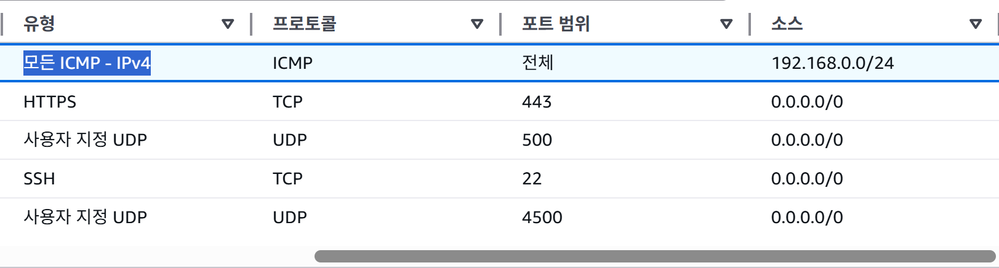
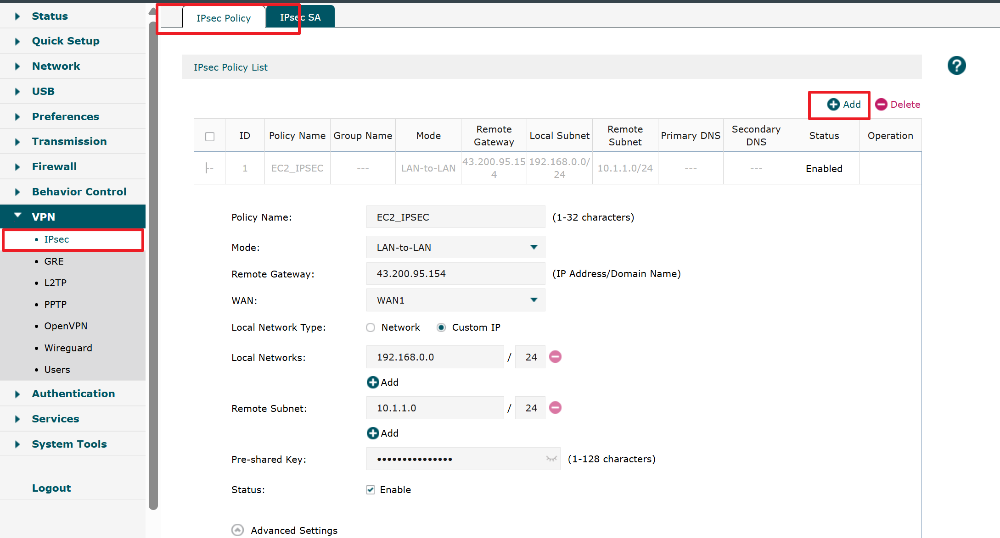
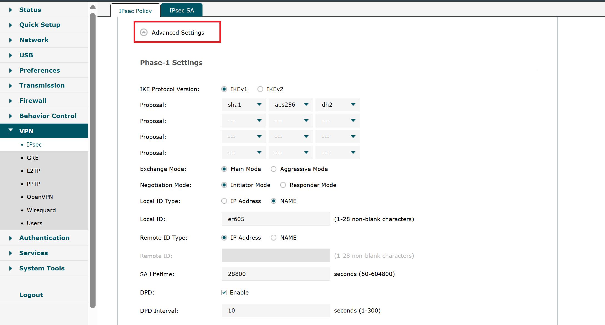
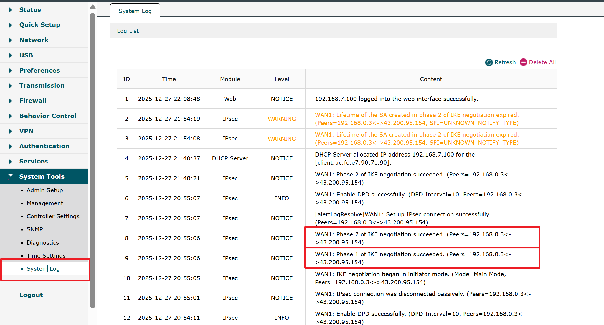

## ER605-AWS-VPN IPsec Site-to-Site 설정 

AWS EC2 서버 <-> 온프레미스 내부망 통신 (EC2 ↔ ER605 IPsec Site-to-Site로 VPN 구성)

```

EC2 (AWS) : 10.1.1.0/24
 └ IPsec Server StrongSwan
 |
[EC2 Public IP]
 |
[인터넷]
 |
LGU+ 모뎀 (NAT)
 └ 192.168.219.0/24
 |
공유기 (NAT, 포트포워딩 불가)
 └ 192.168.219.x
 |
ER605
 └ WAN: 사설 IP (공인 IP 없음)
 └ LAN: 192.168.0.0/24
 └ IPsec Client (Initiator)

```

1. VPC 구조

   

|이름| IPv4 CIDR  |
|---|---|
|app_vpc|10.1.0.0/16|
---

2. SUBNET 구조 

|이름| IPv4 CIDR|	가용 영역|
|---|---|---|
|퍼블릭 서브넷1|10.1.1.0/24|apne2-az1 (ap-northeast-2a)|
|프라이빗 서브넷1|10.1.2.0/24|apne2-az1 (ap-northeast-2a)|
|퍼블릭 서브넷2|10.1.3.0/24|apne2-az2 (ap-northeast-2b)|
|프라이빗 서브넷2|10.1.4.0/24|apne2-az2 (ap-northeast-2b)|

---

3. 보안 그룹

* 이름 : vpn-sg
* 인바운드 규칙



* 아웃바운드 규칙


----

4. EC2 가상머신 생성 
가상머신 이름 : vpn-server
AMI : Ubuntu Server 22.04 LTS (HVM),EBS General Purpose (SSD) Volume Type
인스턴스 유형  : t3.micro
키 페어(로그인)  : kosa_aws_2025
네트워크 설정 : app-vpc
서브넷 : 퍼블릭 서브넷1
방화벽(보안 그룹) : vpn-sg


5. 탄력적 IP 주소 할당


연결된 인스턴스 ID : EC2 가상머신 - vpn-server id 찾아서 설정 

---
6. EC2 Ubuntu (StrongSwan) 설정

6-1. 설치

```bash
sudo apt update
sudo apt install -y strongswan
```

6-2. IP Forwarding 활성화

```bash
sudo tee /etc/sysctl.d/99-ipsec.conf <<EOF
net.ipv4.ip_forward=1
net.ipv4.conf.all.accept_redirects=0
net.ipv4.conf.all.send_redirects=0
EOF

sudo sysctl --system

```

6-3. PSK 설정

```bash
sudo vi /etc/ipsec.secrets

%any %any : PSK "통신을 위한 비밀번호설정함"

```

6-4. IPsec 설정

```bash
sudo vi  /etc/ipsec.conf

config setup
    charondebug="ike 2, knl 2, cfg 2"

conn er605
    auto=add
    type=tunnel
    keyexchange=ikev1
    authby=psk

    left=%any
    leftid=43.200.95.154
    leftsubnet=10.1.1.0/16

    right=%any
    rightid=@er605
    rightsubnet=192.168.0.0/24

    ike=aes256-sha1-modp1024!
    esp=aes128-sha1!

    dpdaction=restart
    dpddelay=30s
    dpdtimeout=120s
```

6-5. StrongSwan 재시작

```bash
sudo ipsec restart

```

6-6. StrongSwan 모니터링(IPsec SA 상태 확인)
```bash

sudo watch ipsec statusall

```

7. ER605 설정 (TP-Link Omada 기준)

7-1. VPN → IPsec → IPsec Policy

- 기본정보 

Pre-shared Key 필드에는 반드시 **`통신을 위한 비밀번호설정함`** 입력 

- phase1 정보 


- phase2 정보 


7-2 시스템 로그 확인 




8. 확인 

8-1 EC2 → 사무실 PC

```
ping 192.168.0.1

PING 192.168.0.1 (192.168.0.1) 56(84) bytes of data.
64 bytes from 192.168.0.1: icmp_seq=1 ttl=63 time=6.02 ms
64 bytes from 192.168.0.1: icmp_seq=2 ttl=63 time=6.05 ms
64 bytes from 192.168.0.1: icmp_seq=3 ttl=63 time=6.25 ms
64 bytes from 192.168.0.1: icmp_seq=4 ttl=63 time=6.03 ms
64 bytes from 192.168.0.1: icmp_seq=5 ttl=63 time=5.97 ms
64 bytes from 192.168.0.1: icmp_seq=6 ttl=63 time=6.54 ms
64 bytes from 192.168.0.1: icmp_seq=7 ttl=63 time=5.93 ms
```

8-2  사무실 PC -> EC2 
```
ping 10.1.1.59

Ping 10.1.1.59 32바이트 데이터 사용:
10.1.1.59의 응답: 바이트=32 시간=6ms TTL=63
10.1.1.59의 응답: 바이트=32 시간=6ms TTL=63
10.1.1.59의 응답: 바이트=32 시간=6ms TTL=63
10.1.1.59의 응답: 바이트=32 시간=6ms TTL=63

10.1.1.59에 대한 Ping 통계:
    패킷: 보냄 = 4, 받음 = 4, 손실 = 0 (0% 손실),
왕복 시간(밀리초):
    최소 = 6ms, 최대 = 6ms, 평균 = 6ms
```

