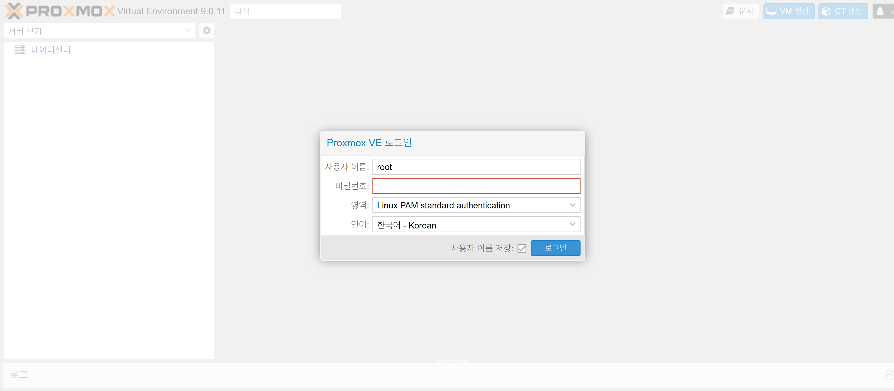
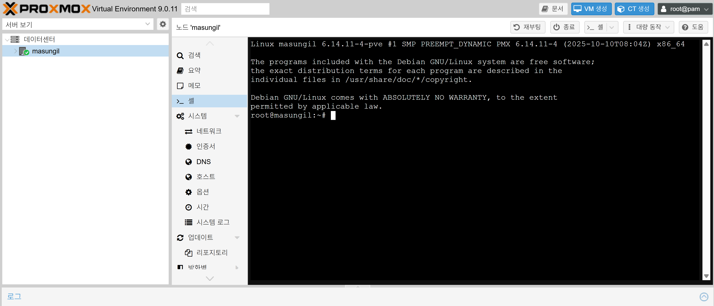
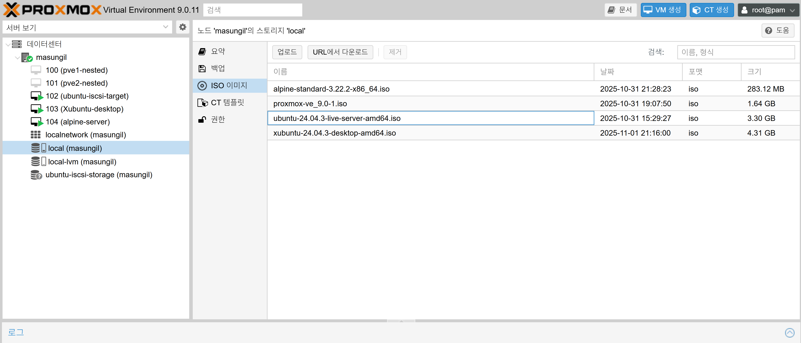

## 1단계: Proxmox VE 설치 및 초기 설정

   1. Proxmox 부팅 USB 제작: 다운로드한 Proxmox VE ISO 파일과 USB 제작 도구를 사용하여 부팅용 USB를 만듭니다.

   2. Proxmox VE 설치:
       * 만든 USB로 컴퓨터를 부팅하여 Proxmox VE 설치를 진행합니다.
       * 주의: 이 과정은 컴퓨터의 모든 데이터를 삭제합니다.
       * 설치 과정 중 네트워크 설정에서, 사용할 고정 IP 주소, 게이트웨이(공유기 주소), DNS 등을 입력합니다. (예: IP 192.168.1.100)
       * 설치가 완료되면 USB를 제거하고 재부팅합니다.

   3. 초기 설정 (원격 접속):
       * 재부팅 후 Proxmox 서버의 모니터에는 IP 주소가 표시된 검은색 텍스트 콘솔 화면이 나타납니다. 이제 이 컴퓨터는 서버이므로 직접 조작하지 않습니다.
       * 스마트폰이나 잠시 빌린 노트북의 웹 브라우저를 열고 주소창에 https://<Proxmox-IP>:8006 (예: https://192.168.1.100:8006)을 입력하여 Proxmox 웹 UI에 접속하고 로그인합니다.

      

---
   4. APT 리포지토리 수정:
       * 웹 UI에서 pve 노드를 선택하고 쉘(Shell) 메뉴를 엽니다. 

       
       
       1단계: PVE 엔터프라이즈 리포지토리 비활성화

      기본으로 활성화된 유료 PVE 리포지토리 목록 파일을 수정하여 주석 처리(비활성화)하겠습니다.

      - 아래 명령어로 pve-enterprise.list 파일을 엽니다.

        ```
        vi /etc/apt/sources.list.d/pve-enterprise.sources
        ```
      - 파일 안에 아래와 같은 줄이 보일 것입니다.

        ```
        Types: deb
        URIs: https://enterprise.proxmox.com/debian/pve
        Suites: trixie
        Components: pve-enterprise
        Signed-By: /usr/share/keyrings/proxmox-archive-keyring.gpg
        ```       

      - 위파일을 #을 붙여서 아래와 같이 주석으로 만들어 비활성화하고 저장(wq)합니다. 

        ```
        #Types: deb
        #URIs: https://enterprise.proxmox.com/debian/pve
        #Suites: trixie
        #Components: pve-enterprise
        #Signed-By: /usr/share/keyrings/proxmox-archive-keyring.gpg
        ```       

      2단계: PVE 비구독자용 리포지토리 활성화

      이제 무료로 사용할 수 있는 리포지토리 주소를 새로 추가합니다. 가장 깔끔한 방법은 비구독자용 리포지토리 파일을 새로 만들어주는 것입니다.

      * 아래 명령어를 쉘에 그대로 복사하여 붙여넣기 하세요.
      
```
vi /etc/apt/sources.list.d/pve-no-subscription.list
Types: deb
URIs: http://download.proxmox.com/debian/ceph-squid
Suites: trixie
Components: no-subscription
Signed-By: /usr/share/keyrings/proxmox-archive-keyring.gpg

```

      3단계: Ceph 엔터프라이즈 리포지토리 비활성화

      오류 메시지에 Ceph 관련 오류도 포함되어 있으므로, 동일하게 처리해 줍니다.

      - 아래 명령어로 ceph.list 파일을 엽니다.
        ```
        vi /etc/apt/sources.list.d/ceph.sources
        ```
        ceph.list 파일 안에 아래와 같은 줄이 보일 것입니다.

        ```
        Types: deb
        URIs: https://enterprise.proxmox.com/debian/ceph-squid
        Suites: trixie
        Components: enterprise
        Signed-By: /usr/share/keyrings/proxmox-archive-keyring.gpg
        ```
      - 파일 앞에 #을 붙여 주석 처리하고 저장합니다.
        ```
        #Types: deb
        #URIs: https://enterprise.proxmox.com/debian/ceph-squid
        #Suites: trixie
        #Components: enterprise
        #Signed-By: /usr/share/keyrings/proxmox-archive-keyring.gpg
        ```
      4단계: Ceph 비구독자용 리포지토리 활성화

      PVE와 마찬가지로 Ceph용 무료 리포지토리를 추가합니다.

      * 아래 명령어를 쉘에 그대로 복사하여 붙여넣기 하세요.
      ```
      vi /etc/apt/sources.list.d/ceph-no-subscription.list
      Types: deb
      URIs: http://download.proxmox.com/debian/ceph-squid
      Suites: trixie
      Components: no-subscription
      Signed-By: /usr/share/keyrings/proxmox-archive-keyring.gpg
      ```

      APT 키리스트 확인

      Proxmox 저장소 서명키가 설치되어 있어야 오류 없이 패키지를 받아옵니다.
      
      ```
      ls /usr/share/keyrings/proxmox-archive-keyring.gpg
      ```

      키가 없으면 설치:
      
      ```
      apt update && apt install proxmox-archive-keyring
      ```
          

      5단계: apt update 재시도

      모든 설정이 완료되었습니다. 이제 아래 명령어를 다시 실행하여 업데이트를 시도합니다.

        ```
        apt update  && apt upgrade -y
        ```
      * 설정 완료 후, 쉘에서 apt update && apt upgrade -y 명령을 실행하여 시스템을 최신 상태로 만듭니다.

---

   5. ISO 이미지 업로드:
       * 웹 UI의 pve -> local (pve) 스토리지 -> ISO 이미지 메뉴로 이동합니다.
       * 업로드 버튼을 눌러 미리 다운로드해 둔 Xubuntu, Alpine Linux, Ubuntu Server의 ISO 파일 3개를 모두 업로드합니다.

      


