## 4단계: Xubuntu Desktop VM 생성 (메인 PC 역할)

Xubuntu Desktop VM 시스템 구성 

  * 이름 : Xubuntu-desktop
  * OS: Xubuntu ISO 이미지 선택
  * 디스크: 스토리지 local-lvm, 크기 64 GB
  * CPU: 코어 2
  * 메모리: 4096 MB (4 GB)

1. VM 생성 버튼을 클릭하고 아래 사양으로 생성합니다.
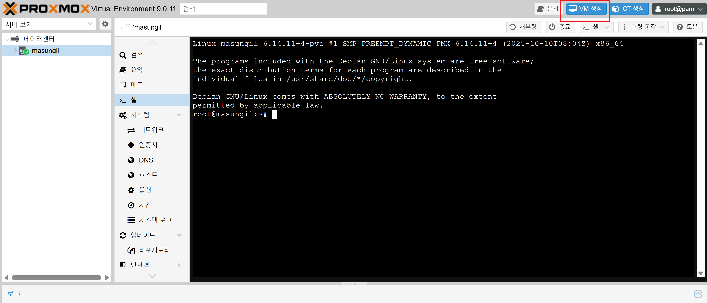

2. 일반 탭 화면에서 VM **이름**을 Xubuntu-desktop 입력하고 **부팅 시 시작**을 선택 합니다 
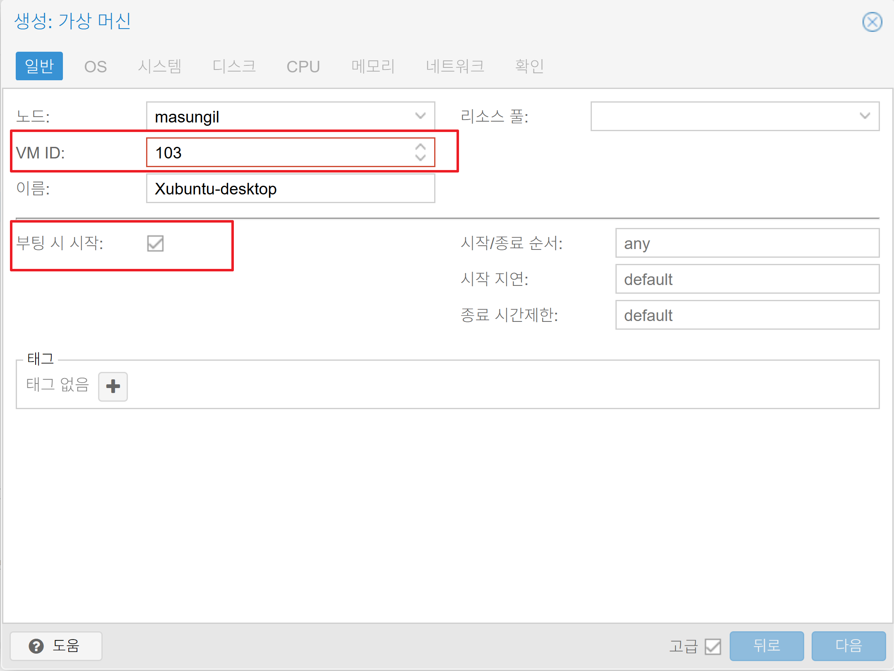

3. OS 탭 화면에서 **OS**: Xubuntu-*-desktop ISO 이미지 선택합니다 
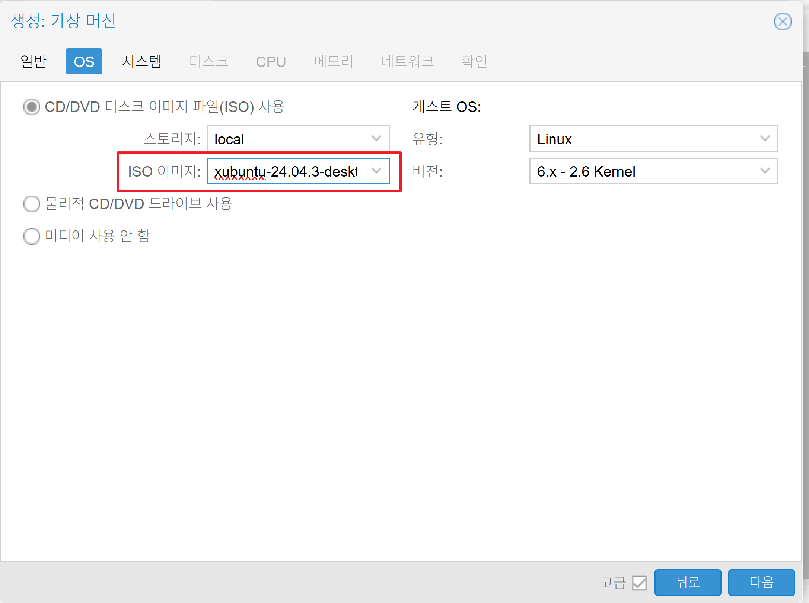

4. 시스템 탭 화면에서 **Qemu 에이전트**을 체크합니다

5. 디스크 탭 화면에서 **스토리지** : local-lvm, **디스크 크기** : 64G로 설정합니다
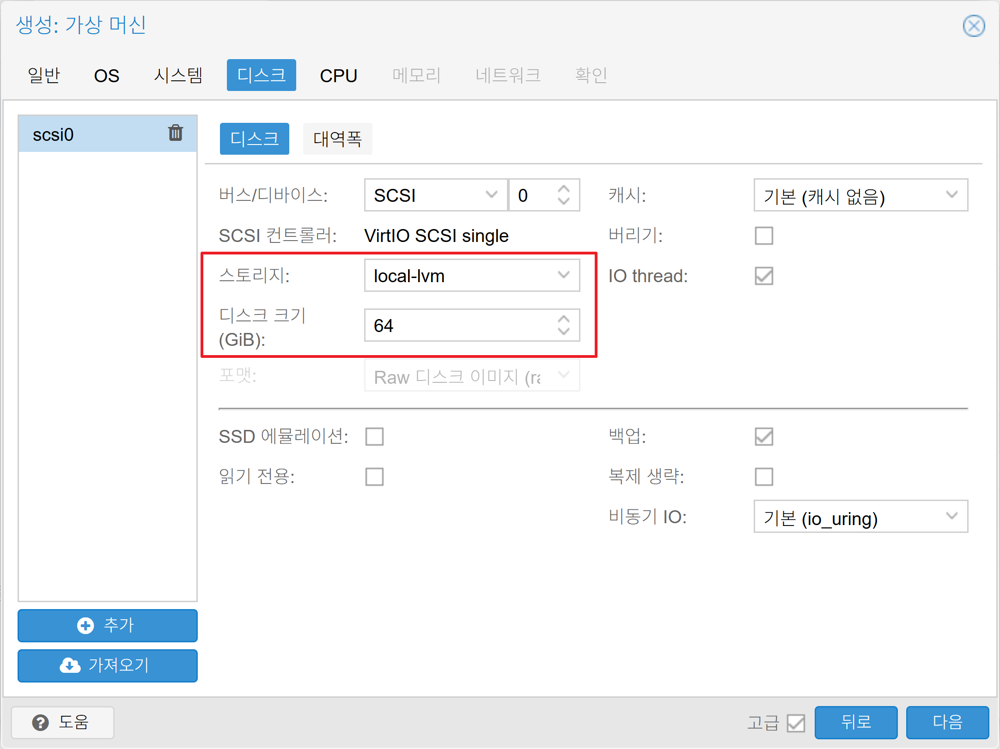

6. CPU 탭 화면에서 **유형** : host, **코어** : 2 설정합니다
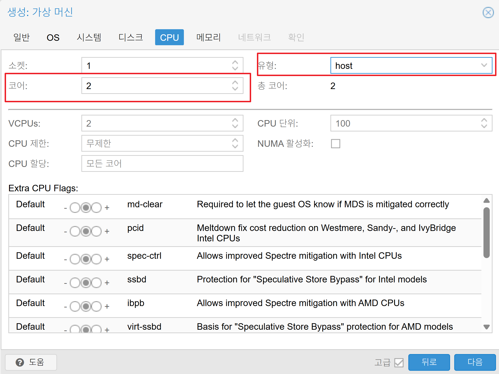

### CPU 유형별 상세 설명

  1. host (호스트 CPU 그대로 사용)
   * 설명: 가장 간단하고 강력한 설정입니다. Proxmox가 설치된 물리 서버의 CPU 모델과 모든 기능(최신 명령어 세트 등)을 VM에게 그대로 노출시켜 줍니다.
   * 장점:
       * 최고의 성능: VM이 물리 CPU의 모든 최신 명령어(AVX, AES-NI 등)를 사용할 수 있어 특정 작업(영상 인코딩, 암호화, 과학 연산 등)에서 최고의 성능을 냅니다.
   * 단점:
       * 실시간 마이그레이션 제약: 이 VM은 CPU 모델이 완전히 동일하거나 더 새로운 다른 호스트로만 마이그레이션할 수 있습니다. CPU 세대가 다른 서버들이 섞여있는 클러스터 환경에서는 마이그레이션이 실패할 확률이 매우 높습니다. (예: Intel 9세대 CPU 호스트 -> Intel 7세대 CPU 호스트로 마이그레이션 실패)

  2. kvm64 (기본 KVM 가상 CPU)

   * 설명: KVM 하이퍼바이저를 위해 만들어진 표준 64비트 가상 CPU입니다. 최신 CPU들의 특별한 기능은 제외하고, 대부분의 64비트 서버에서 공통적으로 지원하는 기본적인 최신 기능들만 포함하고 있습니다.
   * 장점:
       * 높은 호환성: 대부분의 64비트 Intel 또는 AMD CPU에서 문제없이 작동합니다. CPU 세대가 조금씩 다른 서버들로 구성된 클러스터에서 VM의 실시간 마이그레이션을 보장하기 위한 가장 안전하고 일반적인 선택입니다.
   * 단점:
       * 성능 저하 가능성: host 설정과 달리, 물리 CPU가 가진 최신 특별 명령어들을 VM이 사용할 수 없으므로 특정 작업에서 성능이 약간 저하될 수 있습니다.

  3. 특정 CPU 모델 (예: Penryn, Haswell, EPYC-Rome 등)

   * 설명: 특정 세대의 실제 CPU 모델을 가상으로 흉내 내는 것입니다. 예를 들어, 클러스터에 있는 모든 서버의 CPU가 최소 'Intel Haswell' 세대 이상이라면, 모든 VM의 CPU 타입을 'Haswell'로 통일할 수 있습니다.
   * 장점:
       * kvm64보다는 더 많은 기능(성능)을 제공하면서도, 클러스터 내의 모든 호스트가 지원하는 수준으로 기준을 맞춰 마이그레이션 호환성을 확보할 수 있습니다.
   * 단점:
       * 클러스터를 구성하는 모든 CPU의 사양을 정확히 알고 기준 모델을 정해야 하는 번거로움이 있습니다.

  4. x86-64-v2-AES
    * 설명 : 10년 이상 된 웬만한 구형 서버에서도 대부분 지원하는 수준이면서도, kvm64보다는 훨씬 더 나은 성능을 제공하는 매우 합리적인 새로운 '표준'입니다.

    * `x86-64`: 기본적인 64비트 CPU 아키텍처를 의미합니다.

    * `-v2-`: 이것이 핵심입니다. x86-64 아키텍처에는 CPU의 기능 수준에 따라 여러 '마이크로아키텍처 레벨(microarchitecture level)'이 정의되어 있습니다.
      - v1: 모든 64비트 CPU가 지원하는 가장 기본적인 레벨입니다. (옛날의 kvm64는 이 수준에 가깝습니다.)
      - v2: 2009년경 이후에 출시된 CPU(Intel Nehalem, AMD Bulldozer 세대 이상)부터 지원하는 레벨입니다. SSE4.2와 같은 중요한 성능 향상 명령어들을 포함합니다.
      - v3, v4: AVX, AVX2, AVX512 등 훨씬 더 최신의 명령어들을 포함하는 더 높은 레벨입니다.

    * `-AES`: 데이터 암호화/복호화 속도를 하드웨어적으로 크게 높여주는 AES-NI 명령어를 포함한다는 의미입니다. HTTPS 통신이나 디스크 암호화 등 현대적인 작업 매우 유용합니다. 
   * 추천: 특별한 경우가 아니면 x86-64-v2-AES를 사용하는 것이 더 낫습니다.

  5. qemu64
   * 설명: kvm64보다 더 기본적인 기능만 가진 64비트 가상 CPU입니다. 오래된 하드웨어나 다른 가상화 솔루션과의 호환성을 위해 존재합니다.

7. 메모리 탭 화면에서 **메모리** : 4096 설정합니다
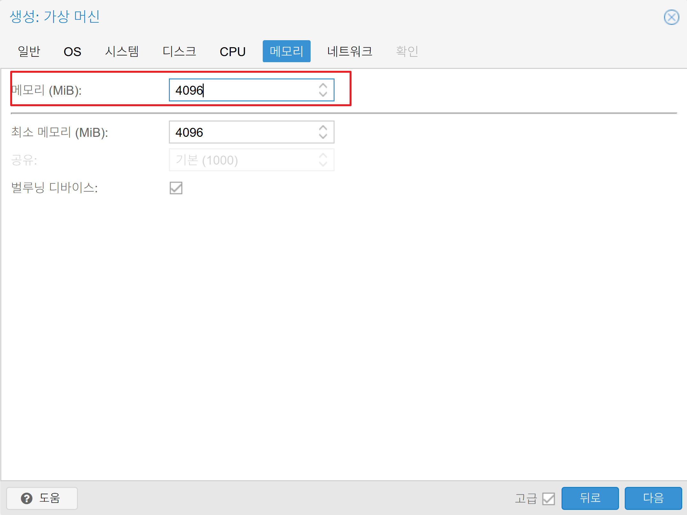

8. 네트워크 탭 화면에서 기본설정을 사용합니다

9. 확인 탭 화면은 설정된 것을 확인하고 문제가 없으면 생성을 클릭합니다
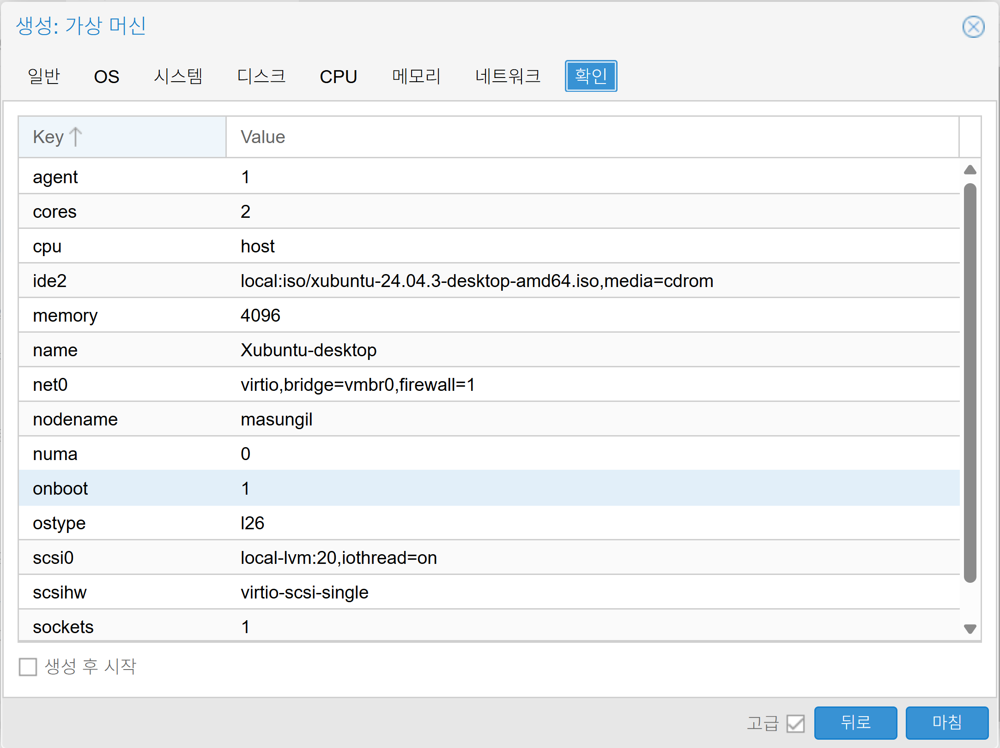

10. 생성된 가상머신을 확인하고 콘솔 버튼을 클릭하고 시작 버튼을 클릭하여 시작합니다 
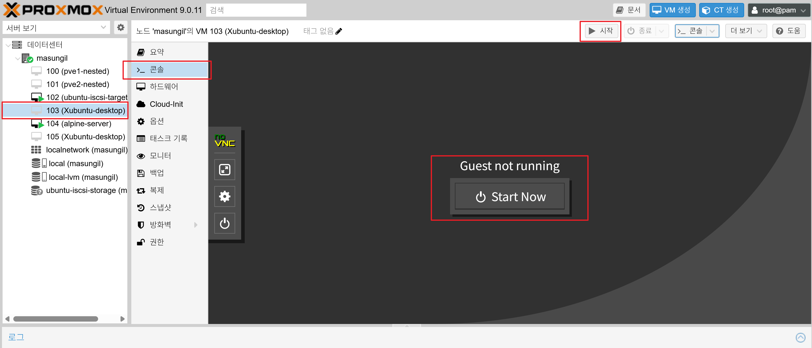

11. Xubuntu 설치를 선택하고 엔터키를 눌러 설치를 진행합니다

12. 잠시만 기다리면 XWindow 설치를 시작할 수 있는 화면이 시작됩니다. 
이때 install Xubuntu 아이콘을 클릭하여 설치 화면을 실행합니다

13. 언어는 한국어를 선택하고 [다음]을 버튼 클릭 합니다  
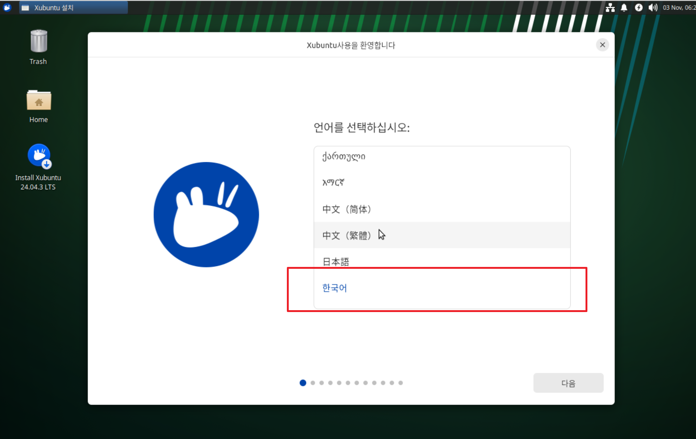

14. 키보드 레이아웃을 한국어로 선택합니다 

15. 네트워크 연결하기 유선 연결하기 사용을 선택합니다 

16. 설치방법은 대화형으로 선택합니다 
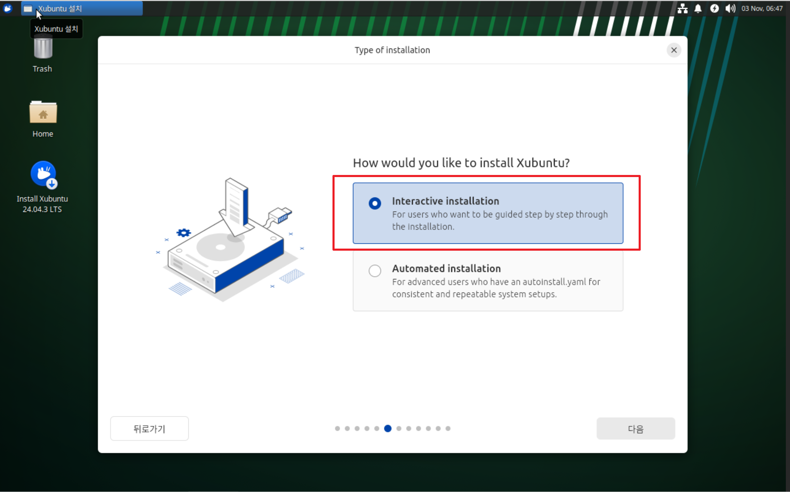

17. 애플리케이션 및 업데이트 방법은 최소 설치를 선택합니다 
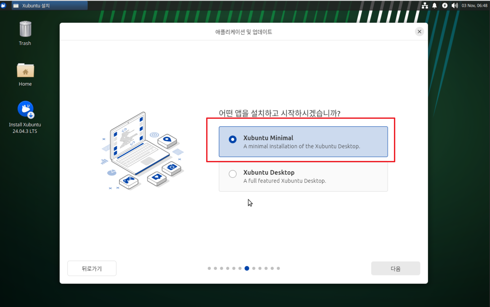

18. 최적화 부분은 설정하지 않습니다 
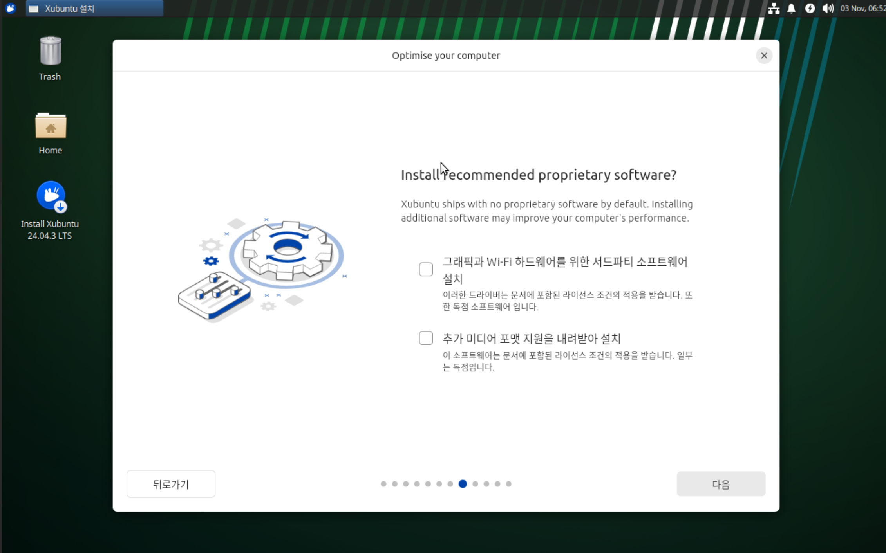

19. 설치 형식은 디스크 지우고 Xubuntu 설치합니다 
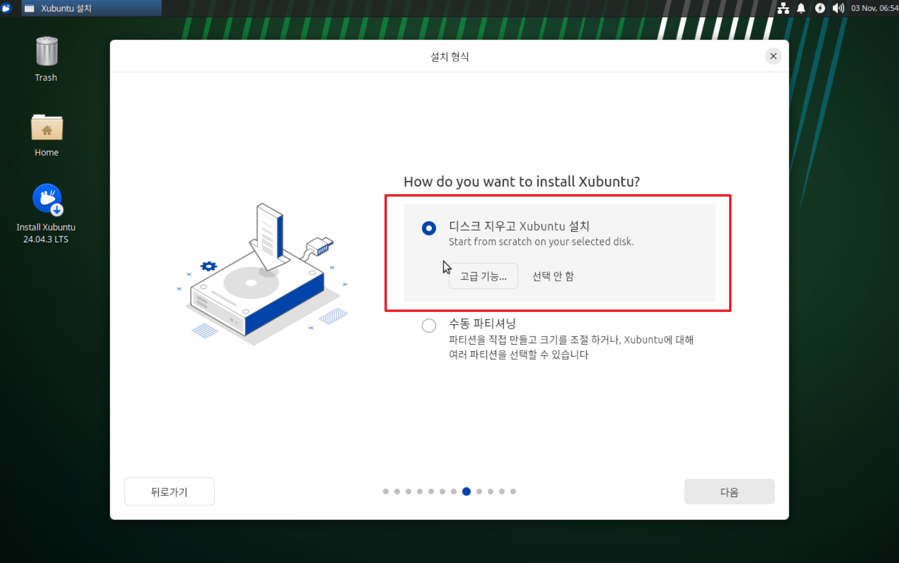

20. 사용자 계정과 컴퓨터 이름, 비밀번호를 설정합니다 

- 사용자이름 : kosa
- 컴퓨터 이름 : desktop
- 사용자 이름 선택 : kosa
- 암호 선택 : kosa1004$
- 암호 확인 : kosa1004$
- 암호는 개인적으로 입력하세요 

21. 시간대, 위치 : Seoul, 시간대 : Asia/Seoul을 선택합니다 
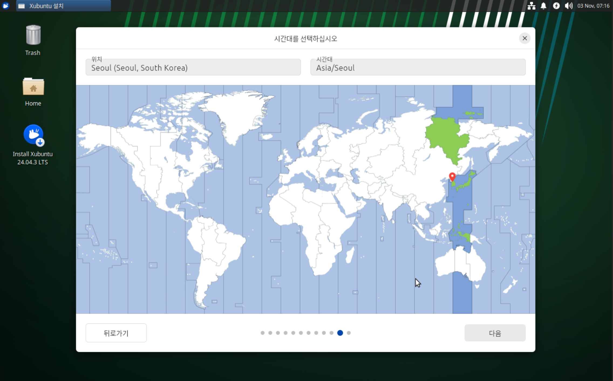

22. 설치 준비완료가 되면 [설치] 버튼을 클릭합니다 
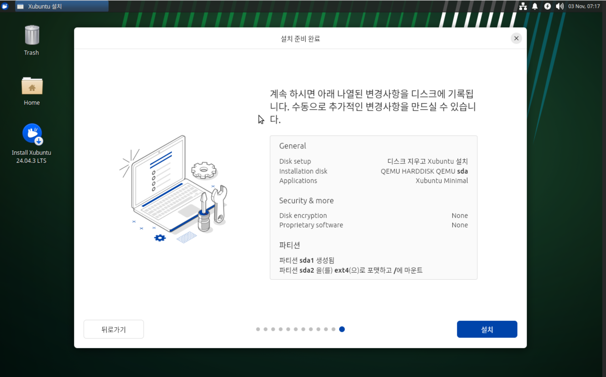

23. 설치를 위해 파일을 복사하고 시스템을 설치가 완료합니다 
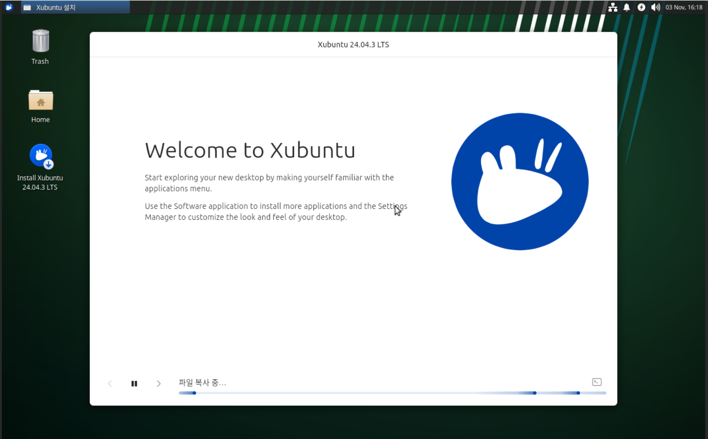

24. 설치가 완료되면 아래와 같이 나옵니다. [지금 다시 시작] 버튼을 클릭합니다 
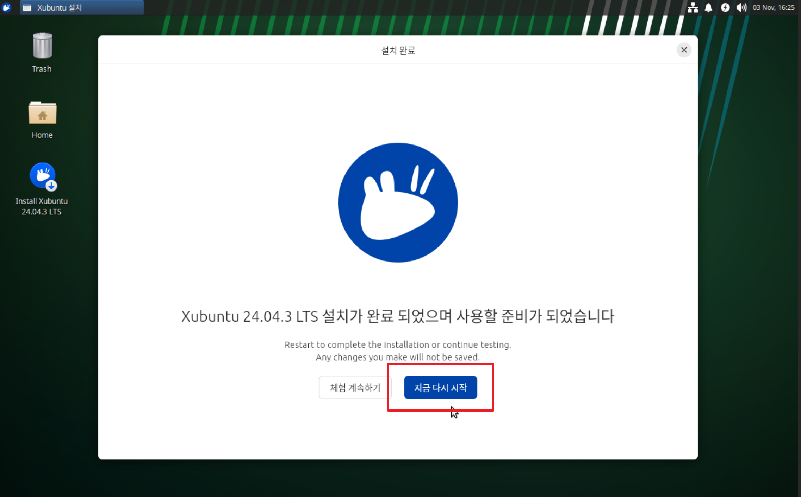

25. 성공적으로 설치가 완료되어 실행된 화면입니다 
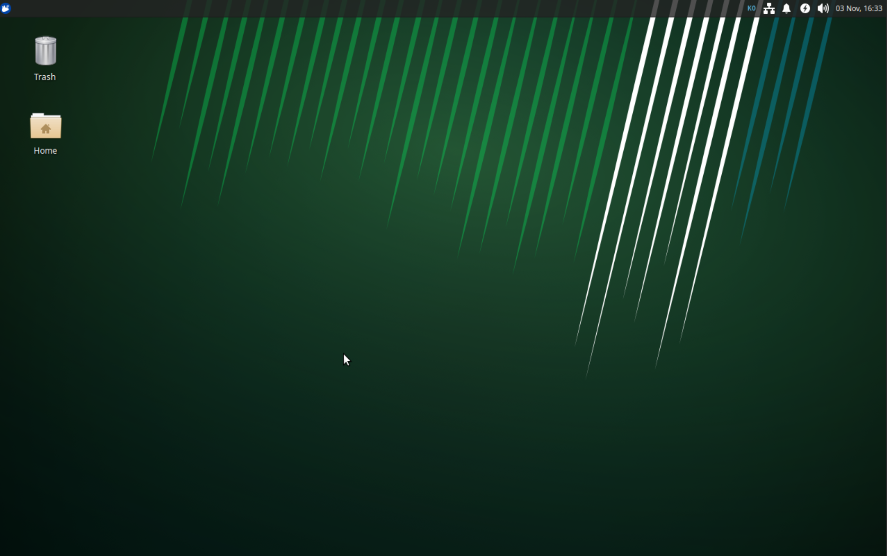

