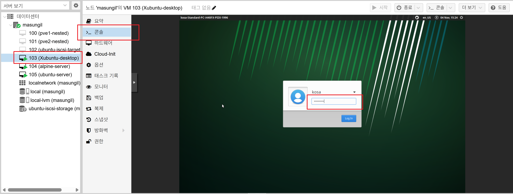
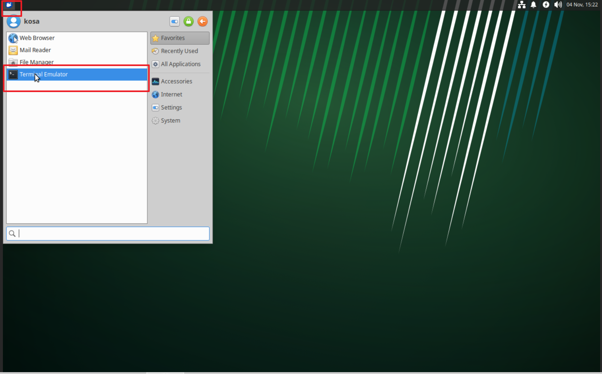
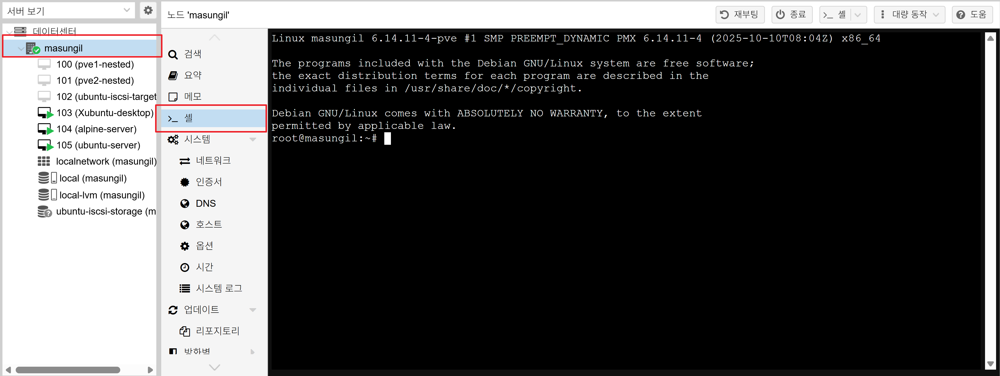
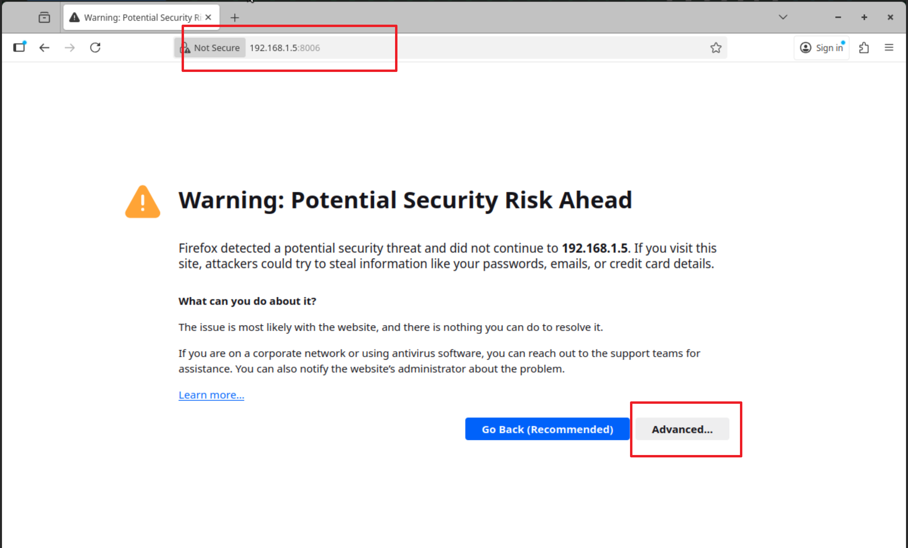
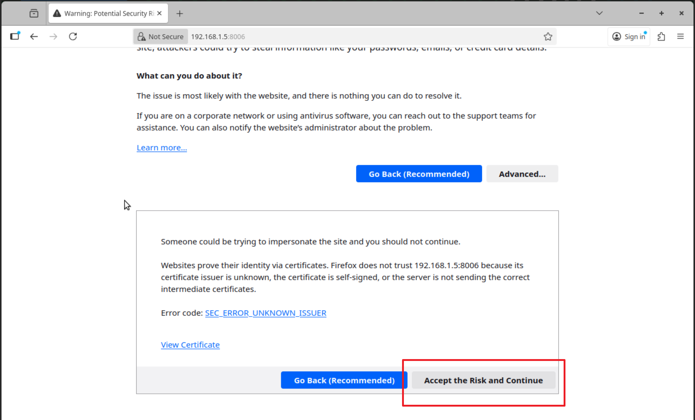
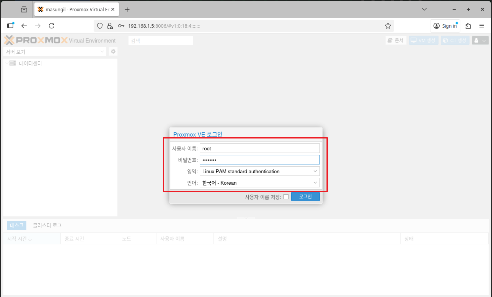
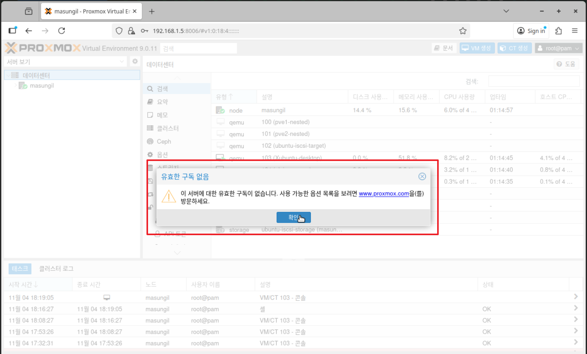

## 4단계: Proxmox에서 Xubuntu Desktop 연동

Proxmox 호스트 자체의 안정성은 최대한 유지하면서, 그 위에 실행되는 Xubuntu VM을 마치 로컬 PC처럼 사용하는 방법을 단계별로 알아보겠습니다.

  핵심 아이디어:
   1. Xubuntu VM에는 원격 데스크톱 연결을 받아주는 '서버' 프로그램을 설치합니다.
   2. Proxmox 호스트에는 무거운 데스크톱 환경 대신, 원격 데스크톱에 접속하는 '클라이언트(접속기)' 프로그램만 설치합니다.
   3. Proxmox 호스트의 모니터에서 '클라이언트'를 실행하여 '서버'(Xubuntu VM)의 화면을 불러와 사용합니다.

  ---

  1단계: Xubuntu 가상머신 설정 (원격 데스크톱 서버 활성화)

  먼저, 다른 곳에서 원격으로 접속할 수 있도록 Xubuntu VM에 xrdp라는 원격 데스크톱 서버를 설치하고 설정해야 합니다.

   1. Xubuntu VM에 접속:
       * Proxmox 웹 UI (스마트폰이나 다른 PC 사용)에서 Xubuntu VM을 선택하고 콘솔을 열어 로그인합니다.
      왼쪽 Xubuntu-desktop VM 선택 -> 콘솔 열기 -> 로그인 화면 비밀번호
      

      

   2. xrdp 설치:
       * Xubuntu VM의 콘솔 안에서 터미널을 열고, 
      터미널을 실행하기 위한 화면
      
      터미널 실행된 화면
      
      
       아래 명령어를 실행하여 xrdp를 설치합니다.
```       
sudo apt update
sudo apt install xrdp -y
```
   3. xrdp 권한 설정:
       * xrdp가 인증서 파일을 읽을 수 있도록 ssl-cert 그룹에 xrdp 사용자를 추가해야 합니다.
```
sudo adduser xrdp ssl-cert
```
   4. xrdp 서비스 재시작 및 상태 확인:
```
sudo systemctl restart xrdp
sudo systemctl status xrdp
```
      active (running)이라는 녹색 글자가 보이면 정상입니다.

   5. 방화벽 설정:
       * Xubuntu의 방화벽이 원격 데스크톱 포트(3389)를 허용하도록 설정합니다.
```
sudo ufw allow 3389/tcp
```

   6. Xubuntu VM의 IP 주소 확인:
       * ip a 명령어를 실행하여 Xubuntu VM의 IP 주소를 확인하고 기록해 둡니다. (예: 192.168.1.6)

  이제 Xubuntu VM은 원격 접속을 받을 모든 준비를 마쳤습니다.

  ---

  2단계: Proxmox 호스트 설정 (원격 데스크톱 클라이언트 설치)

  이제 Proxmox 호스트에 Xubuntu VM에 접속할 '접속기' 프로그램을 설치합니다.
   * 위치: Proxmox 호스트의 쉘 (서버에 직접 연결된 모니터의 검은 화면 또는 SSH)
  

   * 명령어:
```   
echo "deb http://ftp.debian.org/debian trixie main contrib" | tee /etc/apt/sources.list
echo "deb http://ftp.debian.org/debian trixie-updates main contrib" | tee -a /etc/apt/sources.list
```
     
```
# freerdp3-x11 패키지 설치
apt update
apt install freerdp3-x11 -y
```
  이 명령은 무거운 데스크톱 환경 전체가 아닌, xfreerdp라는 원격 접속 프로그램과 이를 실행하기
  위한 최소한의 그래픽 라이브러리만 설치합니다.

  ---

###  3단계: 꺼지지 않는 최소 데스크톱 환경 만들기

1단계: 최소 창 관리자 및 터미널 설치

  1. twm & (창틀 - Window Manager)

   * 이 명령어는 '창 관리자(Window Manager)'를 실행합니다.
   * 창에 제목 표시줄을 만들어주고, 마우스로 창을 이동하거나 크기를 조절하고, 창 닫기(X) 버튼을 누를 수 있게 해주는 '창틀'과 같은 역할을 합니다.
   * 이것이 없으면, xterm 창이 나타나도 제목 표시줄이 없어 마우스로 옮기거나 크기를 조절할 수 없는 원시적인 형태로 나타납니다.
   * 맨 뒤의 &는 이 프로그램을 백그라운드에서 실행하라는 의미입니다.

  2. xterm (유리창 - Terminal Application)

   * 이 명령어는 실제 터미널 프로그램, 즉 '유리창' 역할을 합니다.
   * .xinitrc 파일에서 마지막에 실행되는 이 프로그램(포그라운드 프로그램)이 종료되면, startx는 '세션이 끝났다'고 판단하고 그래픽 모드 전체를 종료시킵니다.
   * 따라서 이 xterm 창이 계속 떠 있는 동안에만 그래픽 세션이 유지되는 것입니다. 우리가 원격 접속 명령어를 테스트할 수 있었던 것도 이 xterm 창이 세션을 계속 붙잡고 있었기 때문입니다.
     
  Proxmox 호스트의 쉘에서 아래 명령어를 실행합니다.
```
apt update
apt install twm xterm -y
```

  2단계: .xinitrc 파일 생성

  이 파일은 startx가 실행될 때 어떤 프로그램을 띄울지 알려주는 '설계도'입니다. 홈 디렉토리에 이 파일을 생성하고 내용을 채웁니다.

  아래 두 줄의 명령어를 순서대로 실행하세요.
```  
echo "twm &" > ~/.xinitrc
echo "xterm" >> ~/.xinitrc
```   
   * twm &: 창 관리자를 백그라운드에서 실행하라는 뜻입니다.
   * xterm: 그 위에 터미널 창을 띄우라는 뜻입니다.

  3단계: startx 실행

  이제 아무런 인자(argument) 없이 startx만 실행합니다.
```  
startx
```
  예상 결과:
  성공했다면, 이번에는 바로 텍스트 모드로 돌아오지 않고, 회색 배경에 마우스 커서가 보이고, 화면 왼쪽 위에 xterm 터미널 창이 하나 나타나 꺼지지 않고 계속 떠 있을 입니다.

  4단계 : xubuntu desktop에 연결
   아래 명령어를 실행하여 xubuntu desktop에 연결합니다. 정상적으로 연결이 되면 xubuntu desktop의 윈도우가 실행된 것을 보실 수 있습니다 
```  
xfreerdp3 /v:192.168.1.6 /d:"" /u:kosa /p:'kosa1004$' /f /kbd:0x00000412 /cert:ignore  
```

/v:192.168.1.6 : xubuntu desktop의 ip 주소입니다 
/d:"" : 도메인이 없음을 의미합니다
/u:kosa : xubuntu desktop 설치시 등록한 사용자 계정명입니다 
/p:kosa1004$ : kosa 계정의 비밀번호 입니다 
kbd:0x00000412 는 '한국어 키보드' 레이아웃을 의미합니다.

---

###  더 편리한 방법: 최종 명령어를 .xinitrc에 직접 넣기

  매번 startx 실행 후 xterm 창에 긴 xfreerdp3 명령어를 입력하는 것은 번거롭습니다. Proxmox 부팅 후 startx 명령어만 입력하면, 자동으로 xterm 없이 바로 Xubuntu 원격 데스크톱에 접속하게 할 수 있습니다.

  .xinitrc 파일을 아래와 같이 수정하면 됩니다.

   1. Proxmox 호스트 쉘에서 아래 명령어로 .xinitrc 파일을 엽니다.
``` 
 vi ~/.xinitrc
```

   2. 기존의 twm & 와 xterm 내용을 모두 지우고, 아래의 `exec xfreerdp3 ...` 한 줄로 완전히 대체합니다. (사용자 이름과 비밀번호는 실제 정보로 바꿔주세요.)
```
exec xfreerdp3 /v:192.168.1.6 /d:"" /u:kosa /p:'kosa1004$' /f  /cert:ignore
```
       * exec는 현재 쉘을 xfreerdp3 프로그램으로 완전히 대체하라는 의미로, 세션의 마지막 명령어로 사용하는 것이 일반적입니다.

   3. 파일을 저장하고 종료합니다. (Esc -> wq -> Enter)

  이제부터는 Proxmox 호스트에 로그인한 후, startx 명령어만 실행하면 터미널 창 없이 바로 Xubuntu 원격 데스크톱 화면이 나타날 것입니다. 그리고 원격 데스크톱을 종료하면, xfreerdp3 프로그램이 종료되면서 그래픽 세션도 자동으로 닫히고 텍스트 모드로 돌아옵니다.


   4. Proxmox 호스트 쉘에서 아래 명령어로 xubuntu desktop에 그래픽 화면으로 연결합니다 
```
startx
```

###  xubuntu desktop 웹 브라우저에서 Proxmox VM 관리 화면 실행

1. 최소 설치(Minimal Installation)'를 선택하여 브라우저 설치되지 않았습니다. 아래 명령어를 Xubuntu의 터미널에서 실행하여 쉽게 설치할 수 있습니다.
```
sudo apt update
sudo apt install firefox
```   

2. Application Menu에 Web Browser 실행 합니다 
저는 교육 중 Proxmox VM Host의 IP가 192.168.1.5라고 가정을 합니다 
여러분은 자신의 Proxmox VM Host의 ip을 확인합니다 
확인 방법은 Proxmox VM Host에 접속하여 터미널 화면에서 ip a 명령어를 실행하면 ip 주소를 확인할 수 있습니다 


주소창에 https://192.168.1.5:8006 입력 하고 이동합니다 .
아래와 같이 https 인증서 문제가 발생합니다 


이때 [Advanced...] 버튼을 클릭하면 아래와 같이 출력됩니다 
아래 [Accept the Risk and Continue] 버튼을 클릭합니다 


실제 접속된 화면입니다.
언어를 한국어로 변경 하고, 사용자이름에 root, 비밀번호을 입력하고 로그인을 합니다 



정상적으로 로그인되면 다음과 같이 화면에 출력되는 것을 확인 할 수 있습니다 

유효한 구독 서비스가 없음이란 메시지는 무시 하셔도 됩니다. 확인 버튼을 클릭하여 경고창을 닫습니다 

