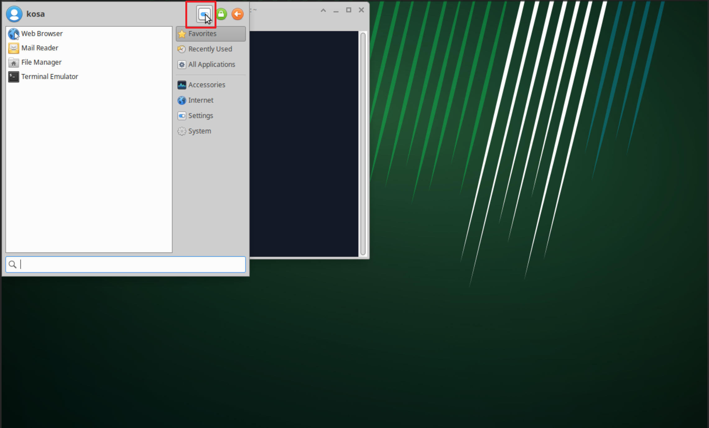
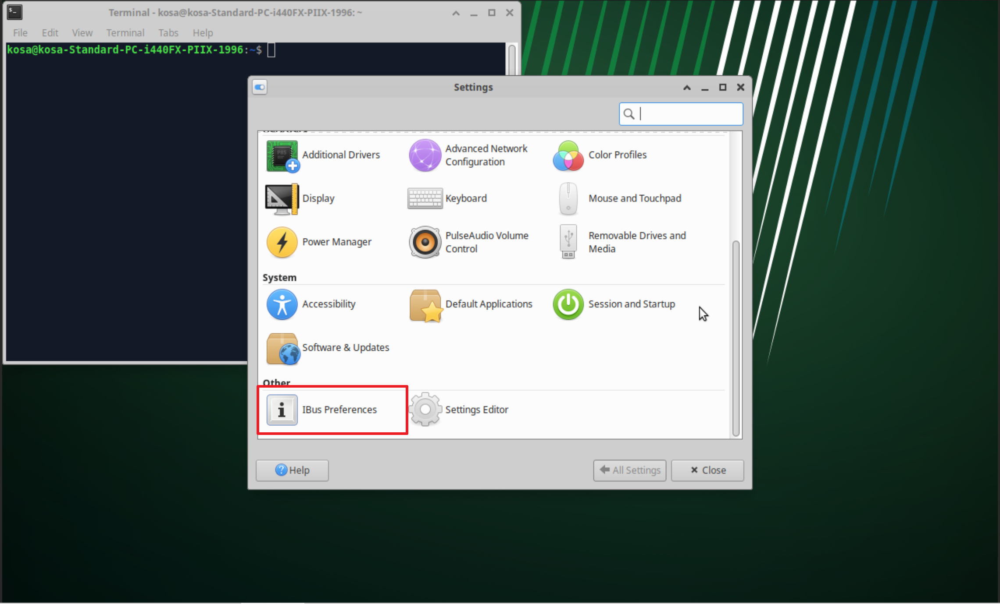
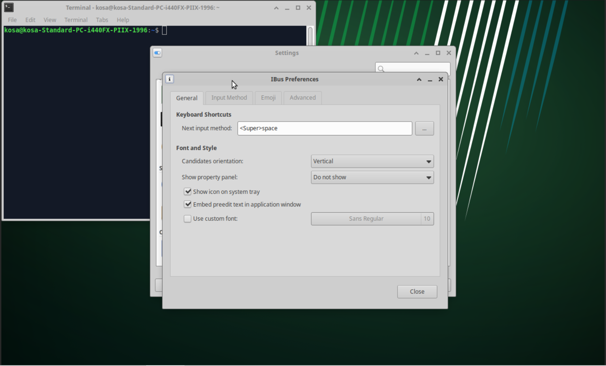
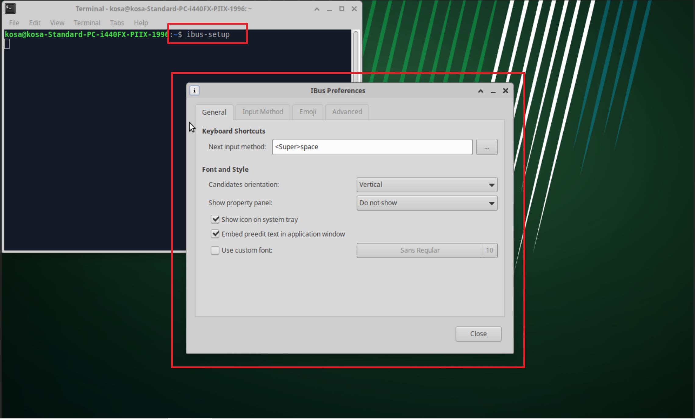
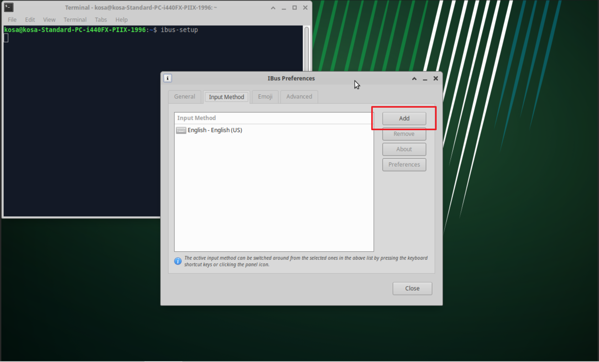
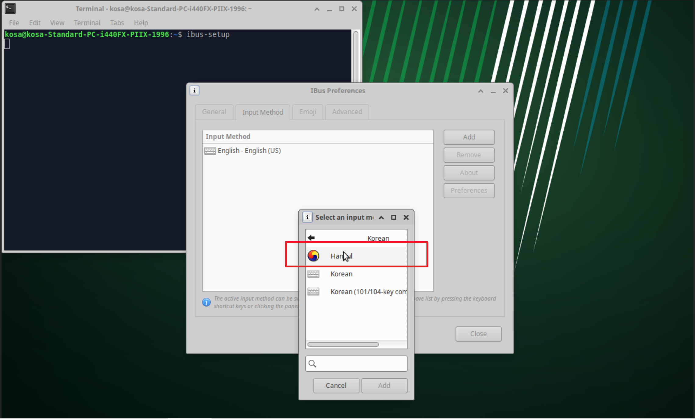
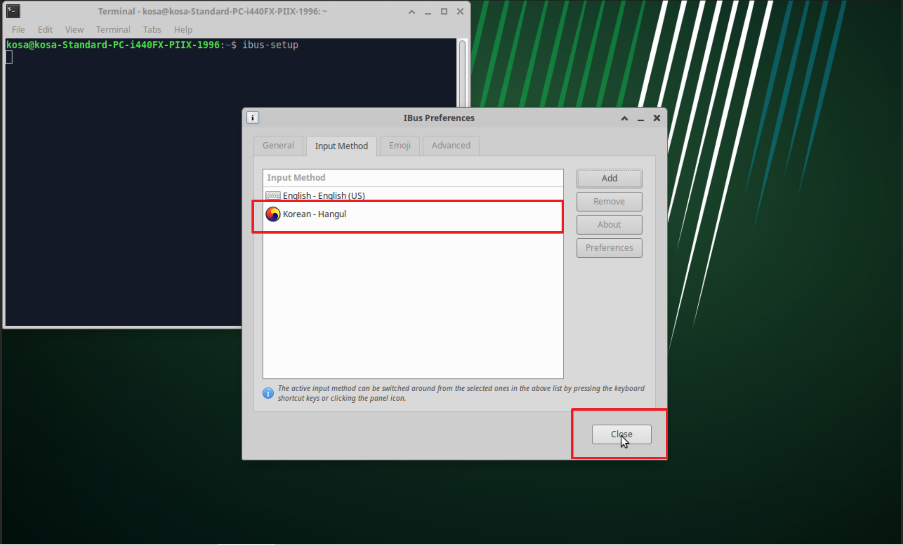
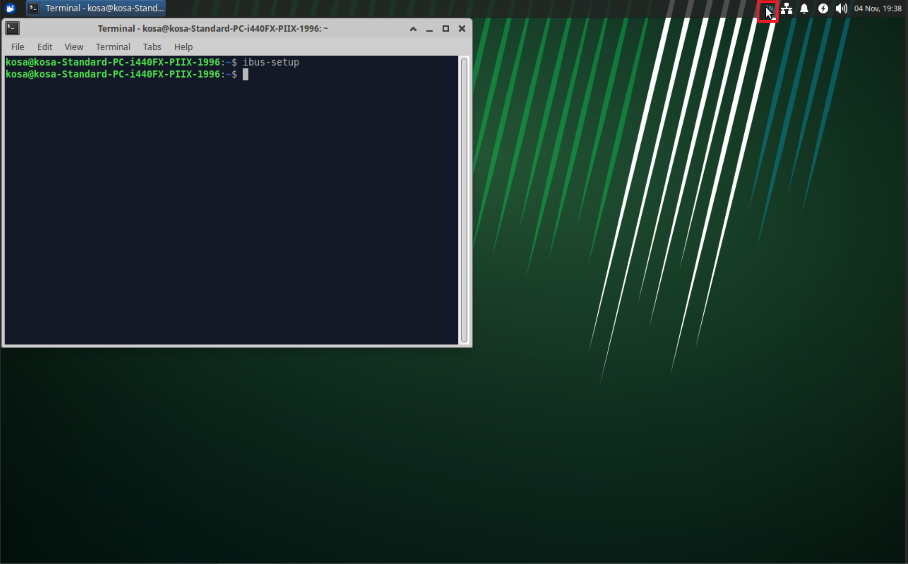

## 5단계: Xubuntu 한글입력설정

Xubuntu Desktop에서 한글을 사용하기 위한 설정 절차를 단계별로 자세히 알아보겠습니다.

  1. 한글 입력기 패키지 설치 
  2. 시스템에 한글 입력기 등록
  3. 한/영 전환 확인의 3단계

  Xubuntu VM의 터미널에서 아래 명령어들을 실행해 주세요.

  ---
  #### 1단계: 필요한 패키지 설치

  먼저, 한글 입력을 처리해 줄 '입력기(Input Method Engine)'를 설치해야 합니다. 리눅스에서는 IBus라는 프레임워크와 ibus-hangul이라는 한글 엔진을 사용하는 것이 가장 표준적인 방법입니다.

   1. 패키지 목록 업데이트:
```   
sudo apt update
```
   2. IBus 한글 입력기 설치:
      * 이 명령어는 IBus 입력기 프레임워크와 한글 입력을 위한 ibus-hangul 엔진을 함께 설치합니다.
```       
sudo apt install ibus-hangul -y
```
   3. (권장) 나눔글꼴 설치:
       * 시스템에 미려한 나눔글꼴을 추가하여 한글이 더 예쁘게 보이도록 합니다.
```
sudo apt install fonts-nanum* -y
```
---

#### 2단계: 시스템에 한글 입력기 등록

패키지 설치가 끝났으면, 시스템이 IBus를 기본 입력기로 사용하도록 설정하고, 그 안에 한글 엔진을 추가해야 합니다.

   1. 시스템 재부팅 또는 재로그인 (가장 확실한 방법):
      * 설치가 완료되면, 시스템을 재부팅하거나 현재 계정에서 '로그아웃' 후 다시 '로그인'하는 것이 가장 확실합니다. 이렇게 하면 새로운 입력기 설정이 시스템 전체에 완벽하게 적용됩니다.
      * Xubuntu VM을 재부팅해 주세요.

   2. IBus 설정 도구 실행:
      * 재부팅 후, 애플리케이션 메뉴 -> 설정 -> `IBus 기본 설정(IBus Preferences)`을 실행합니다.

      * 설정 프로그램 실행 화면       
            

      * 설정 프로그램에서 IBus 찾은 화면       
      

      * IBus 기본 설정 화면 
      
      
      * 만약 메뉴에 보이지 않는다면, 터미널에서 아래 명령어를 직접 실행해도 동일한 설정 창이 나타납니다.
```
      ibus-setup
```   

   * 터미널에서 실행한 화면
   

       * (만약 IBus 데몬을 시작하겠냐는 질문이 나오면 '예(Yes)'를 선택합니다.)

   3. 입력기 추가:
      * 'IBus 기본 설정' 창이 나타나면, 상단의 `입력기(Input Method)` 탭을 클릭합니다.
      * 추가(Add) 버튼을 클릭합니다.
      

      * 언어 목록이 나타나면 스크롤을 내려 `한국어(Korean)`를 찾아서 선택합니다.
      

      * 한국어 아래에 `Hangul` 이라는 항목이 보이면, 그것을 선택하고 추가(Add) 버튼을 누릅니다.
      

      * 이제 '입력기' 탭 목록에 'Korean - Hangul'이 추가된 것을 확인할 수 있습니다.
      
  ---

  3단계: 한글 사용 및 한/영 전환

  모든 설정이 끝났습니다. 이제 실제로 한글을 사용해 보겠습니다.

   1. 입력기 아이콘 확인:
      * 화면 우측 상단 또는 하단 패널에 키보드 모양 또는 태극기 모양의 아이콘이 새로 생긴 것을 볼 수 있습니다. 이것이 IBus 입력기 아이콘입니다.
      


   2. 한/영 전환:
       * 텍스트 편집기나 웹 브라우저의 주소창 등을 클릭하여 커서를 활성화합니다.
       * 한/영 전환은 기본적으로 `Shift + Space` 키를 눌러서 할 수 있습니다.
       * 또는, 패널의 입력기 아이콘을 마우스로 클릭하여 'Hangul'과 'English/US'를 직접 선택할 수도 있습니다.
       * 전환 키를 한/영 키 또는 오른쪽 Alt 키로 바꾸고 싶다면, 'IBus 기본 설정' 창에서 변경할 수 있습니다.

   3. 한자 변환:
       * 한글을 입력한 후 스페이스바를 누르기 전에 `F9` 키를 누르면 한자(Hanja)로 변환할 수 있는 창이 나타납니다.

  이제 Xubuntu Desktop 환경에서 자유롭게 한글을 입력하고 사용하실 수 있습니다.
