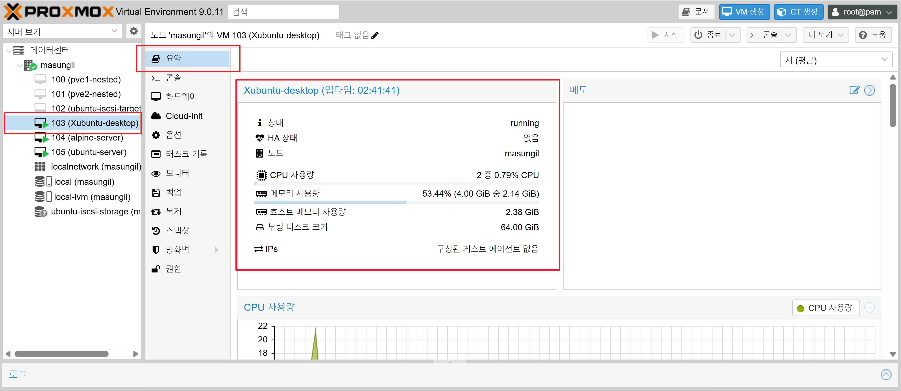
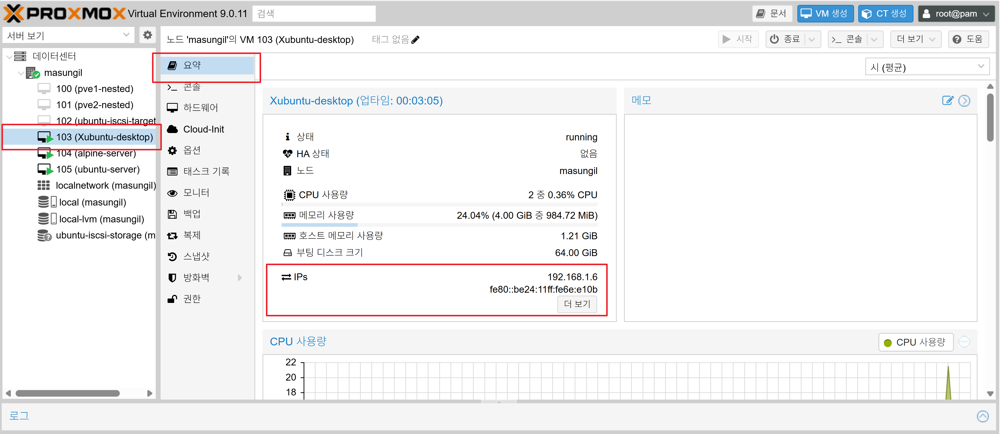
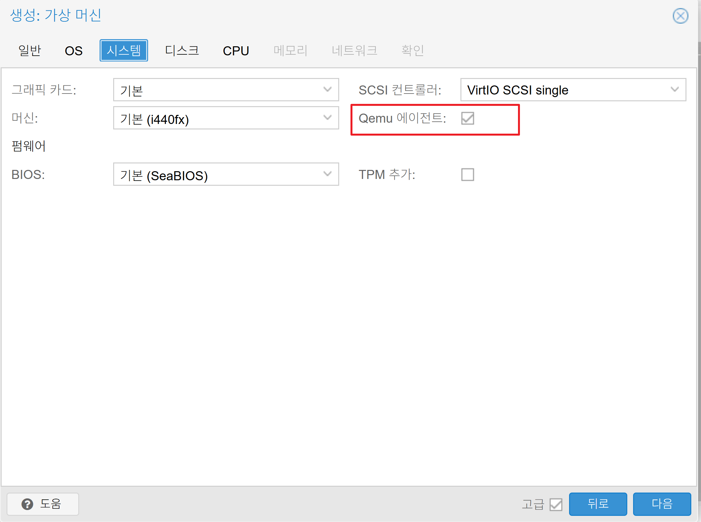
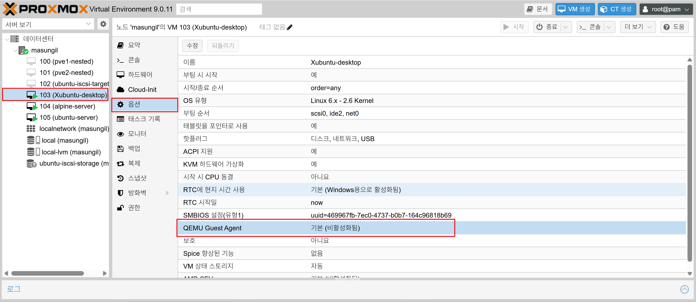
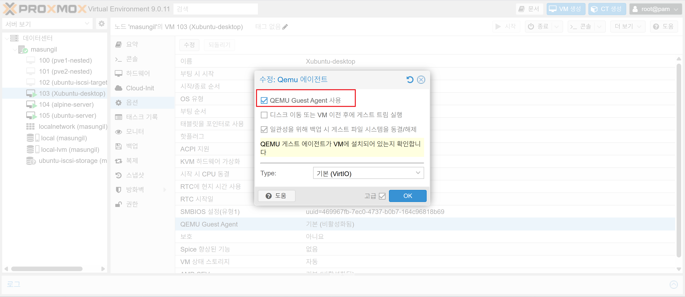
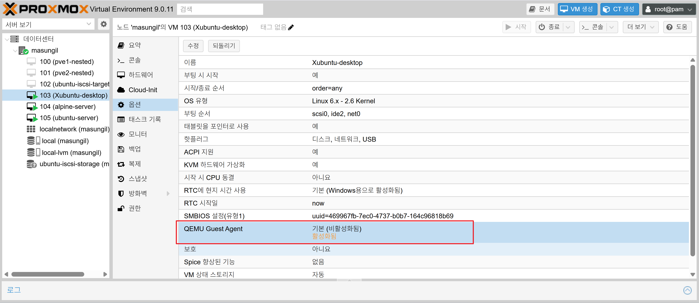

## 6단계: Qemu 에이전트란

### Qemu 에이전트란 ?

간단히 말해, Qemu 에이전트는 Proxmox 호스트와 가상머신(VM) 운영체제(OS)가 서로 '대화'할 수 있게 해주는 통신 프로그램입니다.

기본적으로 Proxmox는 VM의 내부 사정을 전혀 알 수 없는 '블랙박스'로 취급합니다. Proxmox는 VM에 전원을 켜고  끄는 것은 할 수 있지만, VM 안의 OS가 지금 어떤 상태인지, IP 주소는 무엇인지 전혀 알지 못합니다.

Qemu 에이전트 설정 전 요약 화면 


Qemu 에이전트 설정 후 요약 화면 (ip 정보 확인)


Qemu 에이전트는 이 블랙박스 안에 작은 '비서' 또는 '통신원'을 심어두는 것과 같습니다. 이 비서를 통해 Proxmox 호스트는 VM 내부의 상태를 물어보거나, 특정 행동을 정중하게 요청할 수 있게 됩니다.

#### Qemu 에이전트가 활성화되면 할 수 있는 일들

Qemu 에이전트를 설치하고 활성화하면 다음과 같은 핵심 기능들을 사용할 수 있습니다.

  1. VM의 IP 주소 및 정보 표시 (가장 편리한 기능)

  * 에이전트가 없으면, VM의 IP를 확인하기 위해 일일이 VM 콘솔에 로그인해서 ip a 명령어를 쳐야 합니다.
  * 에이전트가 설치되면, Proxmox 웹 UI의 VM `요약(Summary)` 페이지에 해당 VM의 IP 주소가 자동으로 표시됩니다. 여러 VM을 관리할 때 매우 편리합니다.

  2. 깔끔한 종료 및 재부팅 (매우 중요한 기능)

  * 에이전트가 없을 때: Proxmox UI에서 종료(Shutdown) 버튼을 누르는 것은, 마치 실행 중인 컴퓨터의 전원 코드를 뽑아버리는 것과 같습니다. OS나 프로그램이 정상적으로 종료될 시간을 갖지 못해 데이터가 손상될 위험이 있습니다.
  * 에이전트가 있을 때: 종료(Shutdown) 버튼을 누르면, Proxmox가 에이전트에게 "이제 컴퓨터를 정상적으로 종료해주세요" 라고 정중하게 요청합니다. 그러면 VM의 OS는 모든 프로그램을 닫고 시스템을 안전하게 종료하는 절차를 밟습니다. 데이터 무결성을 지키는 데 필수적입니다.

  3. 안정적인 라이브 백업 및 스냅샷

  * 실행 중인 VM을 백업하거나 스냅샷을 찍을 때, 디스크에 데이터가 기록되는 도중에 작업이 이루어지면 백업 파일이 깨질 수 있습니다.
  * 에이전트가 설치되어 있으면, Proxmox는 백업 직전에 에이전트에게 "잠깐만 파일 시스템을 '얼음' 상태로 만들어줘!" (fs-freeze) 라고 요청합니다.
  * 에이전트는 디스크 쓰기를 잠시 멈추고 모든 데이터가 디스크에 기록되도록 보장합니다. 그 순간 Proxmox가 안전하게 백업을 수행하고, 백업이 끝나면 즉시 파일 시스템을 다시 '땡'하고 풀어줍니다. 이를 통해 데이터 손상 없는 안정적인 라이브 백업이 가능해집니다.

  ---

####  Qemu 에이전트 사용 방법 (2단계 설정)

  Qemu 에이전트를 사용하려면 두 단계의 설정이 반드시 필요합니다. Proxmox UI에서 체크만 하는 것으로는 작동하지 않습니다.

  1단계: Proxmox UI에서 'Qemu 에이전트' 옵션 활성화

   * VM을 생성할 때 시스템 탭에서 'Qemu 에이전트' 체크박스를 선택합니다.
    

   * 이미 생성된 VM이라면, 해당 VM의 옵션 탭 -> Qemu 게스트 에이전트 항목을 더블클릭하여 활성화('예')로 변경합니다.

   Qemu 게스트 에이전트 기본(비활성화됨) 화면 
   

   QEMU Guest Agent 사용을 설정 변경화면 
   

   QEMU Guest Agent 사용을 설정 완료화면  
   

   * 이 작업은 Proxmox와 VM이 '대화'할 수 있는 가상의 통신 채널을 만들어주는 것입니다.

  2단계: 가상머신(Guest OS) 내부에 에이전트 프로그램 설치

  이제 VM 안에 '비서' 프로그램을 실제로 설치해야 합니다.

   * Xubuntu / Ubuntu Server의 경우:
       * VM에 로그인하여 터미널에서 아래 명령어를 실행합니다.
```       
sudo apt update
sudo apt install qemu-guest-agent
sudo systemctl enable qemu-guest-agent
```   
       * 설치 후 VM을 반드시 shutdown으로 종료하고 다시 시작을 해야 서비스가 자동으로 시작됩니다.

   * Alpine Linux의 경우:
       * VM에 로그인하여 터미널에서 아래 명령어를 실행합니다.
```
apk update
apk add qemu-guest-agent
rc-update add qemu-guest-agent default
rc-service qemu-guest-agent start
```
   * Windows의 경우:
       * Proxmox가 제공하는 'VirtIO 드라이버 ISO'를 VM의 CD-ROM에 마운트한 후, 그 안의 'guest-agent' 폴더에서 설치 프로그램을 실행해야 합니다.

####  작동 확인

  모든 설정이 완료되고 VM이 실행 중이면, Proxmox 웹 UI에서 해당 VM의 `요약(Summary)` 페이지를 확인해 보세요.
  이전에는 보이지 않던 IP 주소 정보가 나타나면 Qemu 에이전트가 성공적으로 작동하고 있는 것입니다.

  Qemu 에이전트 설정 후 요약 화면 (ip 정보 확인)
  
