## 외이어샤크 설치 

### 원도우11에서 설치 
1. 와이어샤크(Wireshark) 설치를 위해서는 먼저 아래 사이트에 접속합니다.

[와이어샤크(Wireshark) 다운로드 사이트](https://www.wireshark.org/download.html)

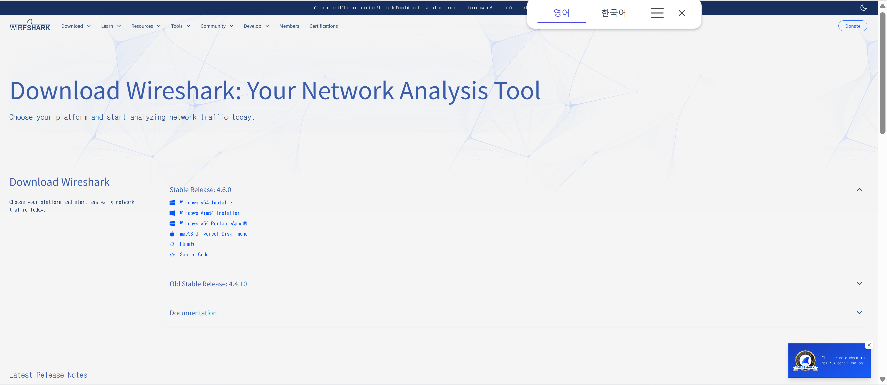

2. 'stable release' 목록에서 운영체제에 맞는 것을 설치합니다.
교육 과정에서는 [Windows x64 Installer]를 다운받아 설치 하겠습니다 

3. 다운로드한 프로그램을 실행합니다. [Next] 버튼을 눌러서 설치를 진행합니다 

4. 라이센스에 대한 안내 화면에서 [Noted] 버튼을 눌러서 설치를 진행합니다 
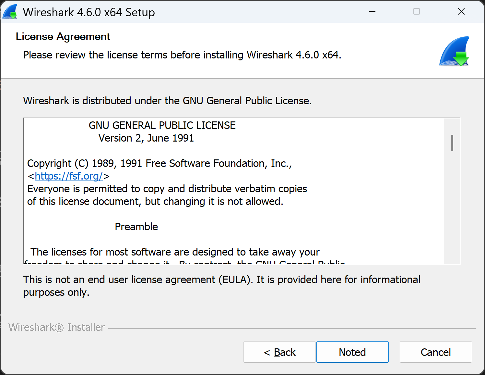

5. 프로패셔널 버전 안내 화면에서 [Next] 버튼을 눌러서 설치를 진행합니다 
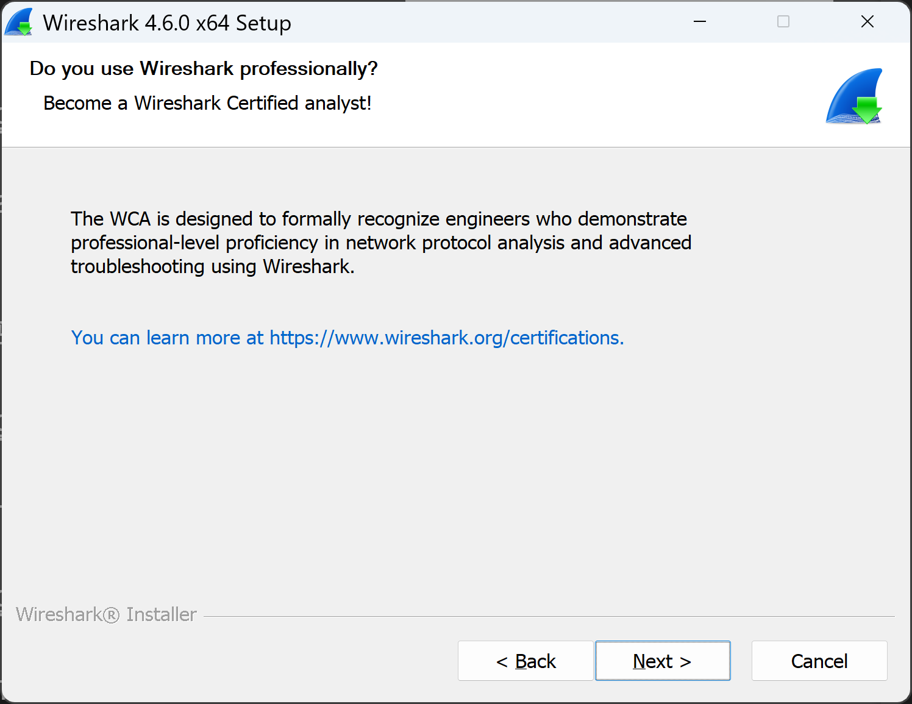

6. 설치 컴포넌트 선택 화면에서 [Next] 버튼을 눌러서 설치를 진행합니다 
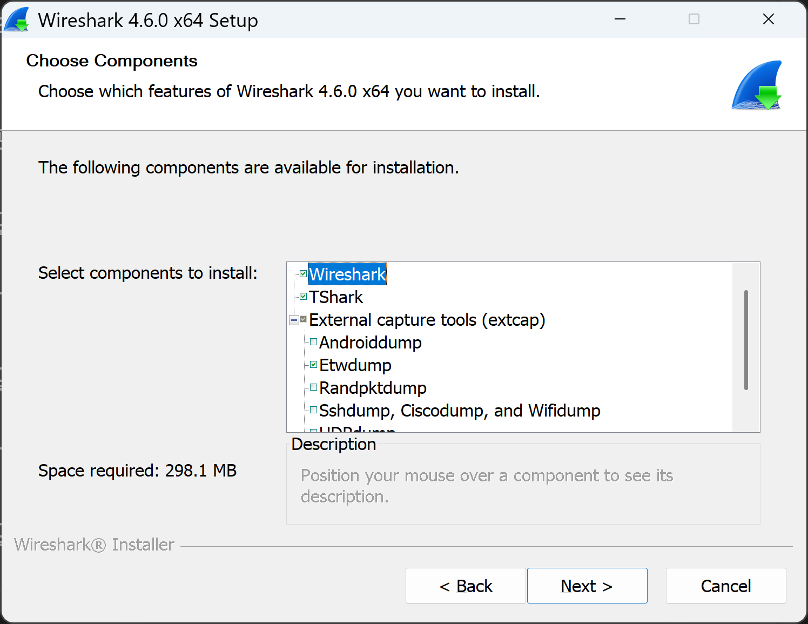

7. 프로그램 아이콘과 파일 확장자에 대한 안내 화면에서 [Next] 버튼을 눌러서 설치를 진행합니다 
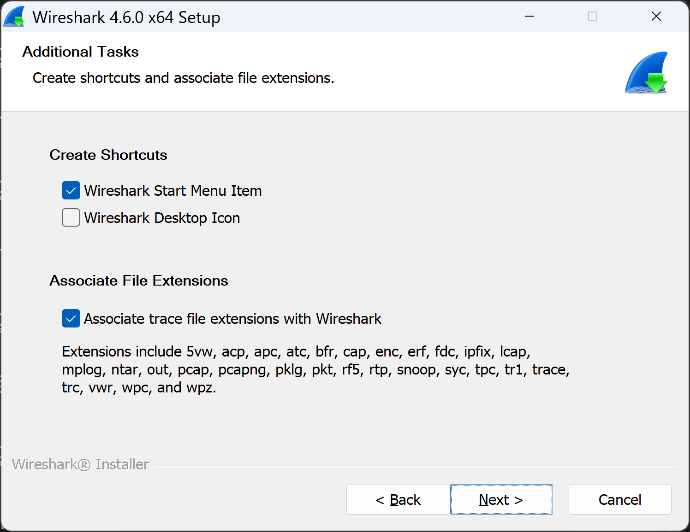

8. 설치 폴더에 대한 안내 화면에서 [Next] 버튼을 눌러서 설치를 진행합니다 
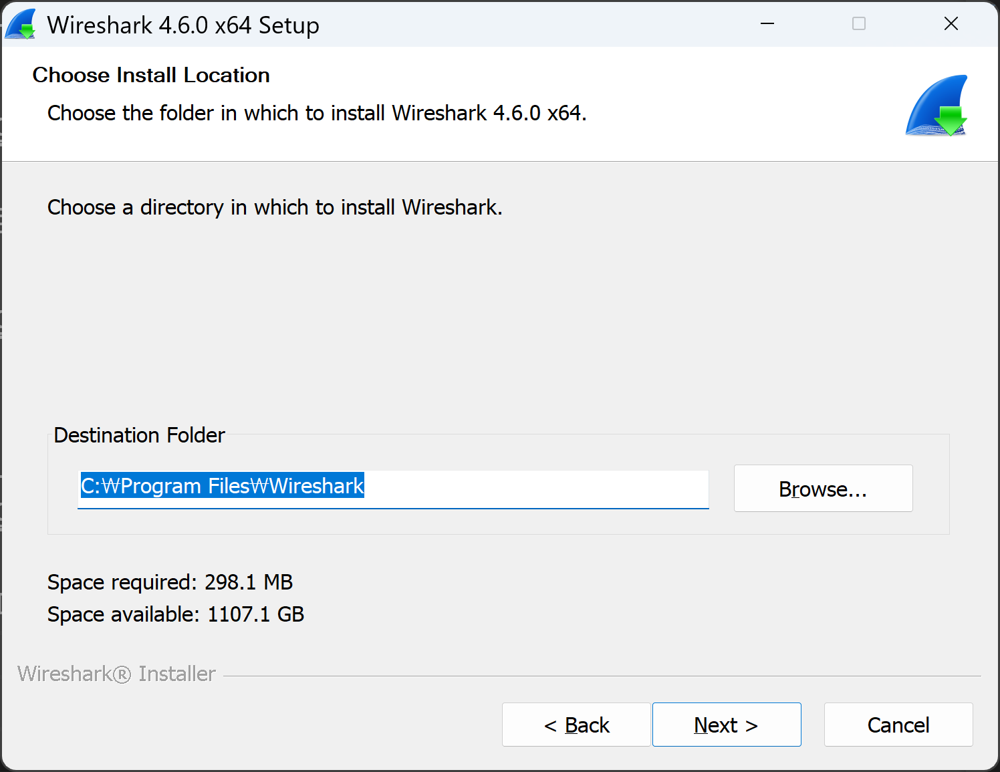

9. Network 캡쳐 프로그램에 대한 안내 화면에서 [Next] 버튼을 눌러서 설치를 진행합니다 
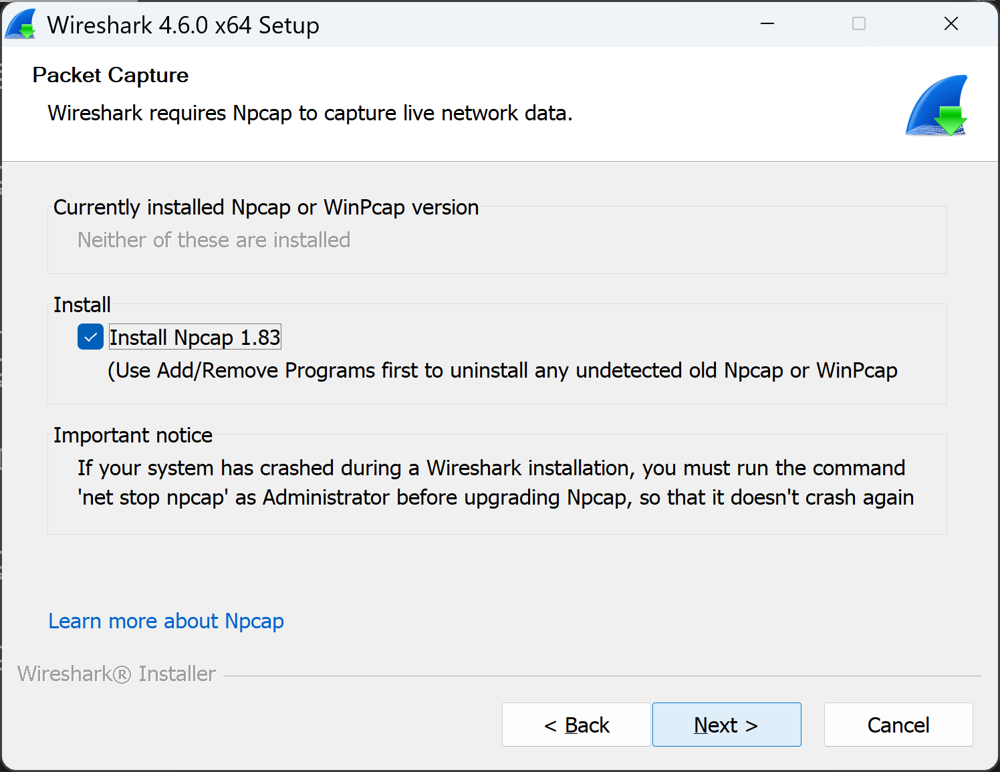

10. USB 캡쳐 프로그램에 대한 안내 화면에서 [Next] 버튼을 눌러서 설치를 진행합니다.
USB 장치에 대한 캡쳐을 하려고 하면 USBPcap 프로그램을 선택하여 설치할 수 있게 한다.(여기서는 선택하지 않음)

11. 프로그램을 설치를 진행합니다 

12. 설치 중 NPcap 프로그램 설치가 기본으로 [Install] 버튼을 눌러서 설치를 진행합니다.
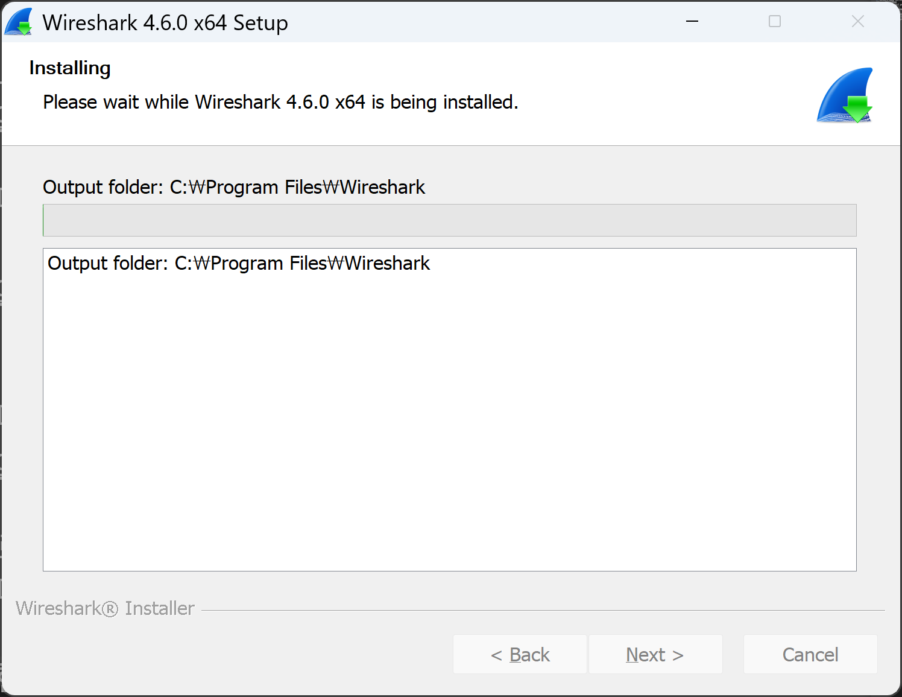

13. NPcap 프로그램 설치 완료 화면에서 [Next] 버튼을 눌러서 설치를 종료합니다 
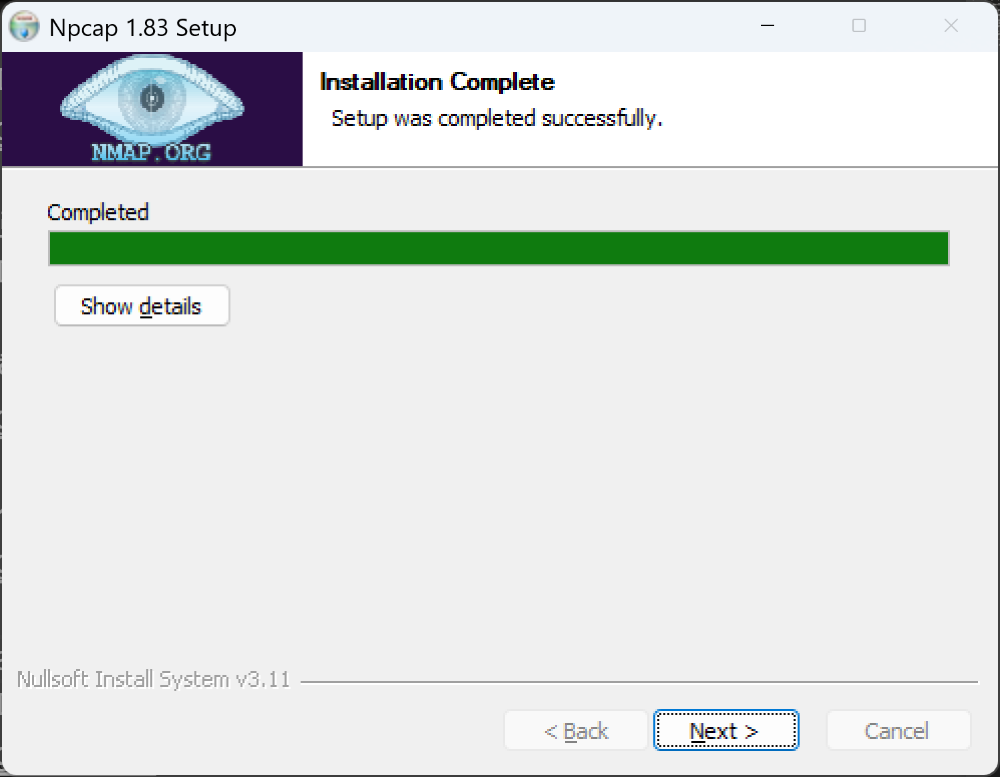

14. NPcap 프로그램 설치 종료 화면에서 [Finish] 버튼을 눌러서 설치를 종료 하고 와이어샤크 프로그램 설치를 계속 진행합니다
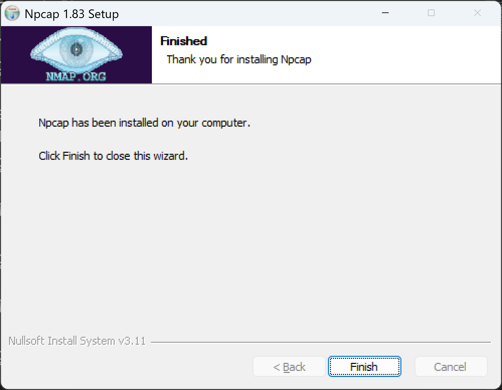

15. 와이어샤크 프로그램 설치 완료 화면에서 [Next] 버튼을 눌러서 설치를 종료합니다 
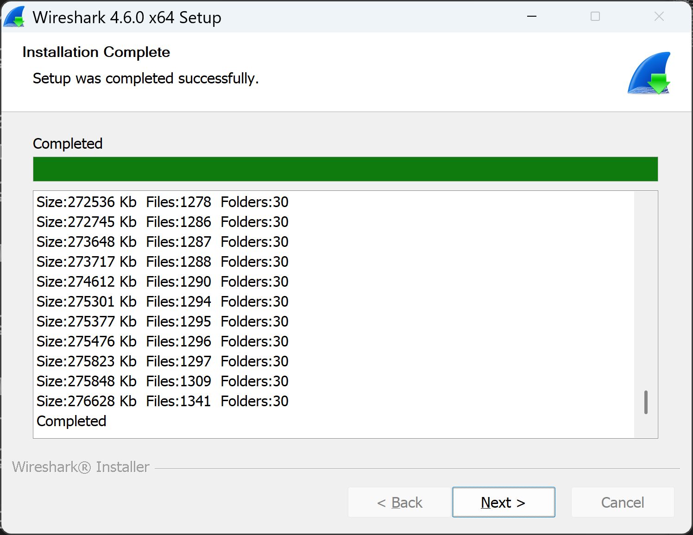

16. 와이어샤크 프로그램 설치 종료 안내 화면에서 [Finish] 버튼을 눌러서 설치를 종료합니다 
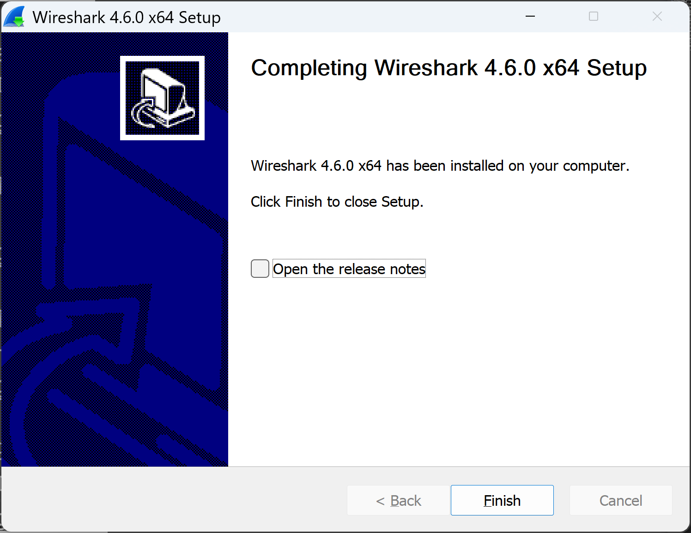

17. 와이어샤크 프로그램을 실행합니다.
캡쳐를 할 네트위크 인터페이스를 선택합니다 
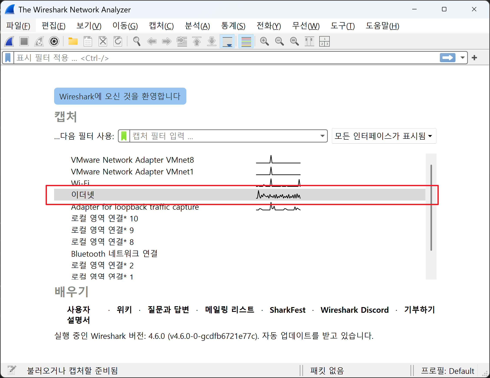

18. 화면에서 이더넷을 더블클릭으로 선택합니다
이더넷으로 송수신 되는 패킷을 확인 할 수 있습니다 
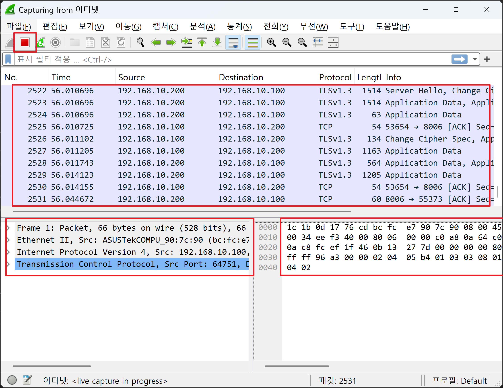
필요한 만큼 모으면 왼쪽 상단의 빨간 정지 버튼을 클릭하면 캡쳐를 종료합니다 

### xubuntu에 설치

