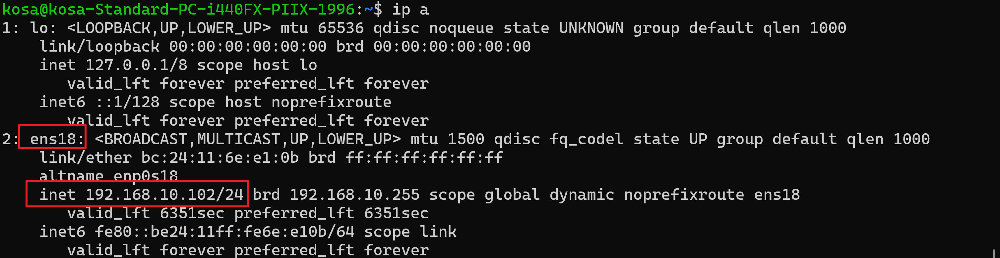
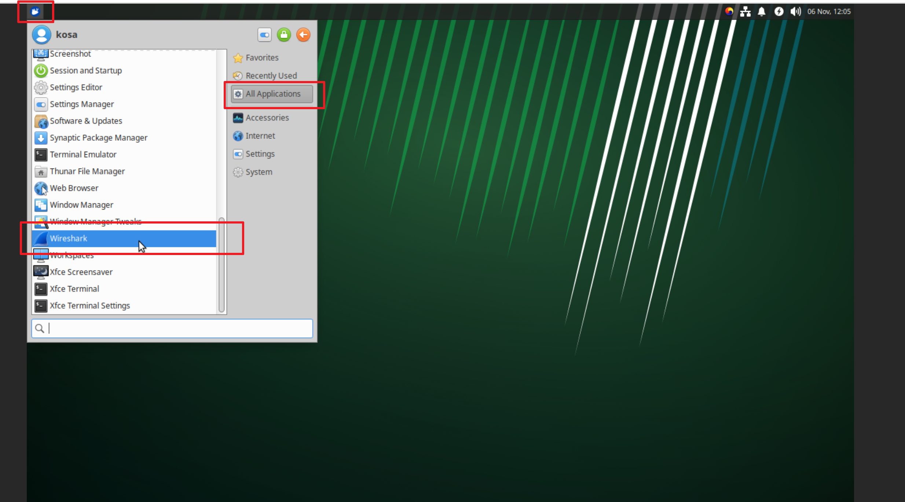
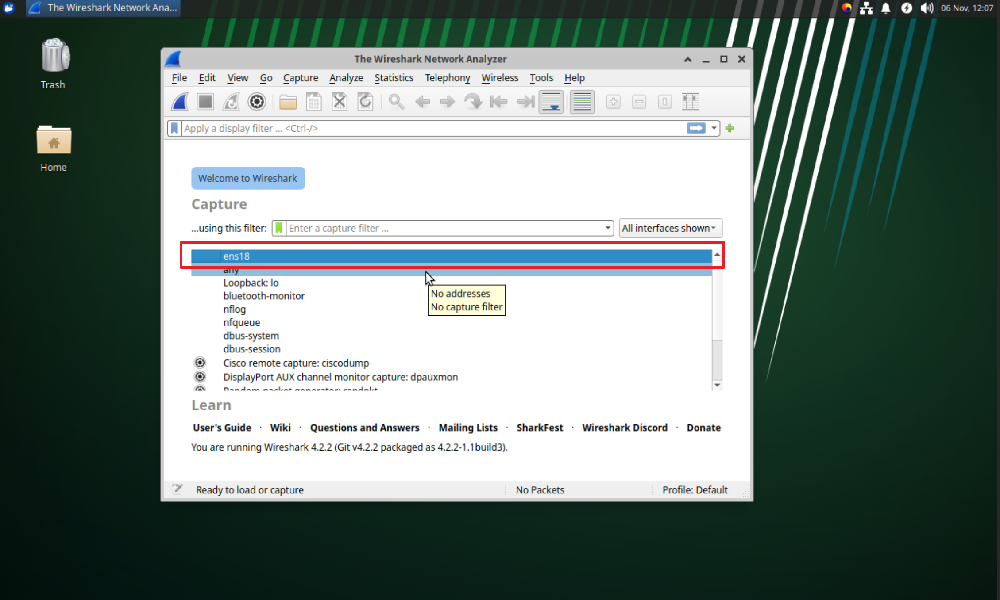
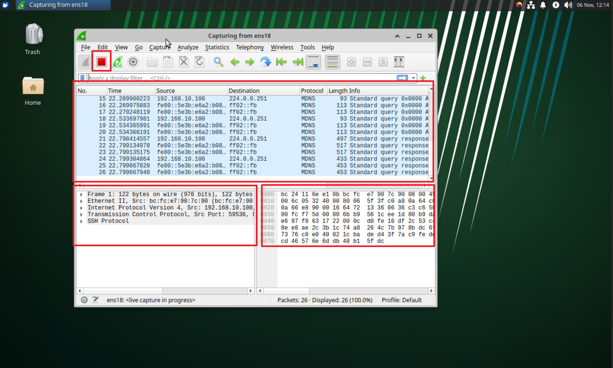

## 외이어샤크 설치 

### xubuntu에 설치
1. 패키지 목록 업데이트
```
sudo apt update
```

2. 와이어샤크 설치
```
sudo apt install wireshark -y
```
    * 중요: 설치 과정 중 'wireshark-common' 패키지에 대한 파란색 설정 화면이 나타납니다.
    

    * "일반 사용자가 패킷을 캡처할 수 있도록 허용하시겠습니까?" (Should non-superusers be able to capture packets?) 라는 질문이 나오면, 키보드 화살표 키를 사용하여 `<예>` (Yes) 를 선택하고 Enter 키를 누르세요.
    * 이렇게 해야 매번 관리자 권한(sudo)으로 와이어샤크를 실행하지 않아도 됩니다.

3. 사용자 계정을 'wireshark' 그룹에 추가 
   패킷 캡처 권한을 얻기 위해 현재 사용자를 wireshark 그룹에 추가해야 합니다. $USER는 현재 로그인된 사용자 이름으로 자동 변경됩니다.
```   
sudo usermod -aG wireshark $USER
```

4. 시스템 재부팅 또는 재로그인
    새로운 그룹 설정을 시스템에 적용하려면 로그아웃 후 다시 로그인하거나 시스템을 재부팅해야 합니다. 가장 확실한 방법은 재부팅입니다.
```
sudo reboot
```
5. 네트워크 인터페이스 이름 확인하기 (사용자 직접 수행)

  먼저, 어떤 네트워크 장치(랜카드)를 통해 통신이 이루어지는지 확인해야 합니다. 사용자의 Xubuntu 터미널을 열고 아래 명령어를 입력하세요.

```
ip a
```
  

  명령어를 실행하면 여러 네트워크 인터페이스 목록이 나옵니다. lo는 로컬 루프백이므로 제외하고, 아래와 같이 eth0, ens18 또는 enp... 등으로 시작하는 인터페이스 중에서 IP 주소 (예: `inet 192.168.10.102/24`)가 할당된 것의 이름을 기억해두세요. 이것이 현재 사용 중인 네트워크 인터페이스입니다.

5. Xubuntu descktop GUI에서 와이어샤크 실행
    재부팅이 완료된 후, 애플리케이션 메뉴 -> Wireshark를 선택하거나 터미널에서 다음 명령어로 실행할 수 있습니다.
    애플리케이션 메뉴 -> Wireshark를 선택 하여 실행 
    

6. Wireshark 캡쳐 프로그램이 실행되고, 메인 목록에 캡쳐를 할 네트위크 인터페이스 목록이 출력됩니다. 이때 ens18을 더블클릭으로 선택합니다.
    

7.  이더넷으로 송수신 되는 패킷을 확인 할 수 있습니다 
    
필요한 만큼 모으면 왼쪽 상단의 빨간 정지 버튼을 클릭하면 캡쳐를 종료합니다 

이제 Xubuntu에서 와이어샤크를 사용하실 수 있습니다.

