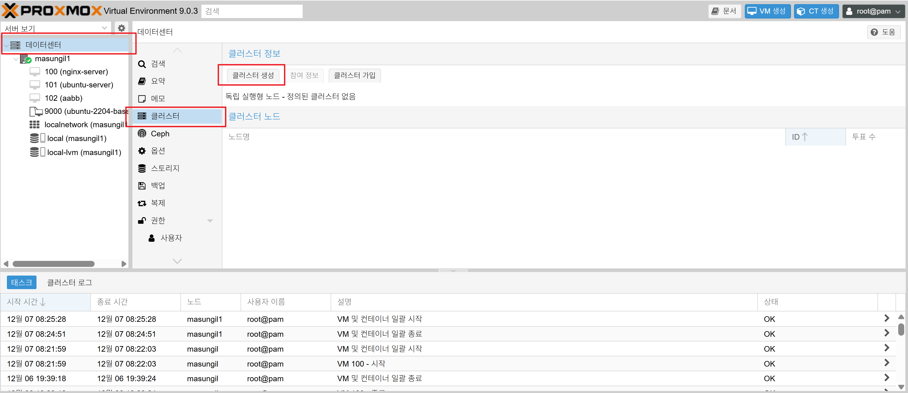
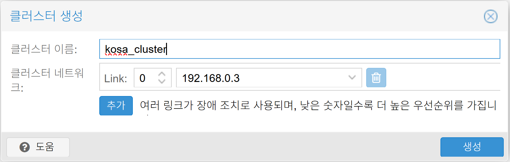
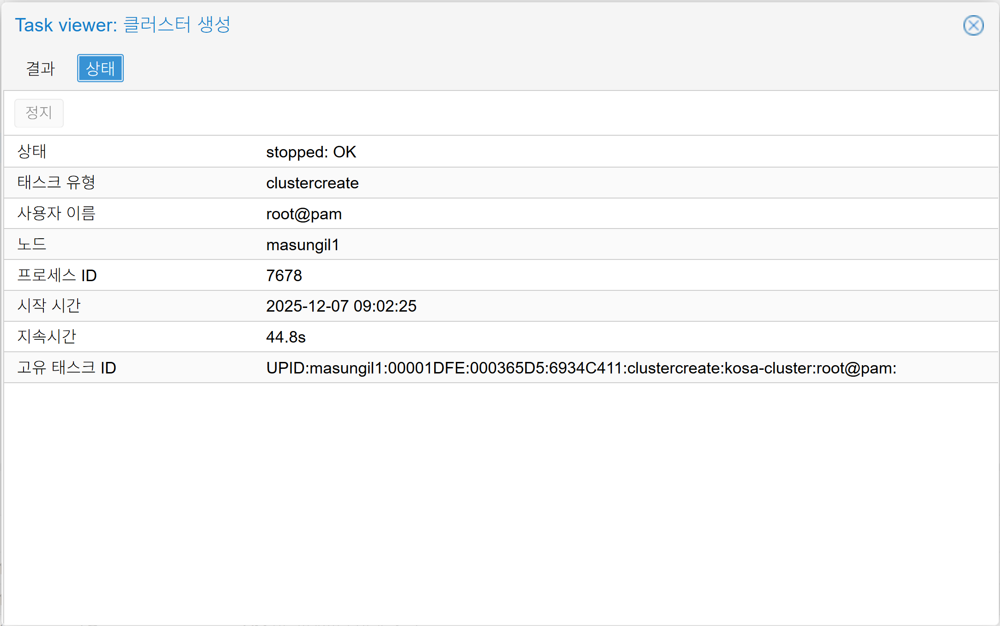
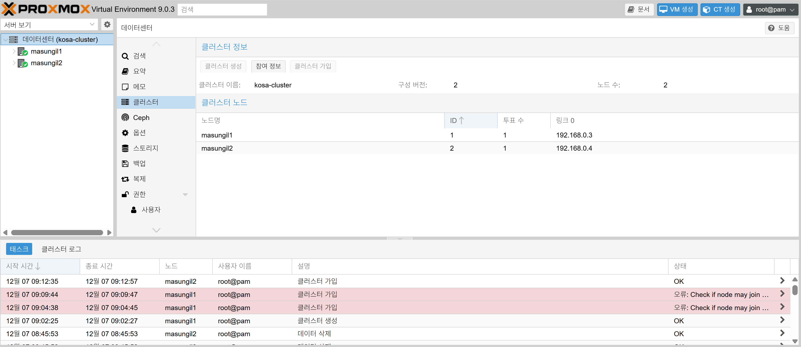

## Proxmox VE 클러스터링

클러스터링은 여러 Proxmox 서버를 하나의 그룹으로 묶어 중앙에서 관리하고, 가상 머신(VM) 및 컨테이너의 고가용성(HA)과 실시간 마이그레이션(Live Migration) 기능을 사용하기 위해 필요합니다.

두 대의 Proxmox 서버를 클러스터링하는 절차는 다음과 같습니다.

1. 사전 준비 사항 (매우 중요)

클러스터링을 시작하기 전에 아래 조건들이 충족되었는지 반드시 확인해야 합니다. 준비가 미흡하면 클러스터가 깨지거나 예상치 못한 문제가 발생할 수 있습니다.

    1. Proxmox VE 버전 통일: 두 노드(서버)의 Proxmox VE 버전이 동일해야 합니다.
    2. 전용 네트워크 인터페이스: 클러스터 통신(Corosync)을 위한 별도의 네트워크 카드(NIC)를 준비하는 것이 강력히 권장됩니다. 1Gbps 이상의 속도를 권장하며, 이 네트워크는 다른 트래픽(VM 트래픽, 스토리지 트래픽 등)과 분리해야 안정적입니다.
    3. 시간 동기화 (NTP): 모든 노드의 시간이 정확하게 동기화되어 있어야 합니다. NTP 클라이언트를 설정하여 시간 서버와 동기화하세요.
    4. /etc/hosts 파일 설정: 각 노드가 서로의 호스트 이름과 IP 주소를 확인할 수 있도록 /etc/hosts 파일을 수정해야 합니다. 예를 들어, 각 노드에서 아래와 같이 설정합니다.

```sh
# /etc/hosts 파일 예시
192.168.0.3 masungil1.co.kr masungil1
192.168.0.4 masungil2.co.kr masungil2
192.168.0.5 masungil3.co.kr masungil3
```

    5. SSH 접속 확인: 한 노드에서 다른 노드로 SSH 접속이 가능한지 확인합니다.
    6. 두 번째 노드 초기 상태: 클러스터에 추가될 노드(두 번째 노드)에는 어떠한 VM이나 컨테이너도 없어야 합니다. 기존에 있던 VM/CT는 백업 후 삭제해야 합니다.

2. 클러스터 생성 및 노드 추가 절차

1단계: 첫 번째 노드에서 클러스터 생성

    1. 첫 번째 노드(마스터가 될 서버)의 웹 GUI 또는 셸(Shell)에 접속합니다.
    2. [데이터 센터] -> [클러스터] -> [클러스터 생성] 버튼을 클릭합니다 



    3. 원하는 클러스터 이름을 지정합니다
        * <클러스터 이름>: 원하는 클러스터 이름을 지정합니다. (예: kosa-cluster)
        * 예시: pvecm create kosa-cluster
    


    4. 명령이 성공적으로 실행되면 클러스터가 생성되고 이 노드가 첫 번째 멤버가 됩니다. pvecm status 명령으로 상태를 확인할 수 있습니다.



```sh
#클러스터 상태를 확인
pvecm status 
```

2단계: 두 번째 노드를 클러스터에 추가

    1. 두 번째 노드(클러스터에 추가할 서버)의 셸에 접속합니다.
```sh
#두 번째 노드(클러스터에 추가할 서버)의 셸에 접속
ssh root@192.168.0.4
```

    2. 셸에서 아래 명령어를 실행하여 첫 번째 노드가 생성한 클러스터에 참여합니다.

```sh
#두 번째 노드를 클러스터에 추가
pvecm add 192.168.0.3

Please enter superuser (root) password for '192.168.0.3': ********
Establishing API connection with host '192.168.0.3'
The authenticity of host '192.168.0.3' can't be established.
X509 SHA256 key fingerprint is XX:XX:XX:XX:XX:XX:XX:XX:XX:XX:XX:XX
Are you sure you want to continue connecting (yes/no)? yes
Login succeeded.
check cluster join API version
No cluster network links passed explicitly, fallback to local node IP '192.168.0.4'
Request addition of this node
Join request OK, finishing setup locally
stopping pve-cluster service
backup old database to '/var/lib/pve-cluster/backup/config-1765066368.sql.gz'
waiting for quorum...OK
(re)generate node files
generate new node certificate
merge authorized SSH keys
generated new node certificate, restart pveproxy and pvedaemon services
successfully added node 'masungil2' to cluster.
```

       * <첫 번째 노드의 IP 주소>: 클러스터 통신용 네트워크의 IP 주소를 사용해야 합니다.
       * 예시: pvecm add 192.168.0.3

    3. 명령을 실행하면 SSH를 통해 인증 정보를 교환하고 클러스터 구성 정보를 동기화합니다. 중간에 yes/no를 묻는 프롬프트가 나타나면 yes를 입력합니다.

3. 클러스터 상태 확인

    1. 두 노드 중 하나의 웹 GUI에 접속합니다.
        * 이제 데이터센터(Datacenter) 뷰에서 두 개의 노드가 모두 보이는 것을 확인할 수 있습니다.



    2. 셸에서 상태 확인 명령을 실행합니다.
        * pvecm status: 클러스터의 전반적인 상태와 멤버 노드들을 보여줍니다.
        * pvecm nodes: 클러스터에 속한 노드들의 목록과 상태를 상세히 보여줍니다.

정상 상태 출력 예시:
```sh
pvecm status
Cluster information
-------------------
Name:             kosa-cluster
Config Version:   2
Transport:        knet
Secure auth:      on

Quorum information
------------------
Date:             Sun Dec  7 09:16:32 2025
Quorum provider:  corosync_votequorum
Nodes:            2
Node ID:          0x00000002
Ring ID:          1.9
Quorate:          Yes

Votequorum information
----------------------
Expected votes:   2
Highest expected: 2
Total votes:      2
Quorum:           2
Flags:            Quorate

Membership information
----------------------
    Nodeid      Votes Name
0x00000001          1 192.168.0.3
0x00000002          1 192.168.0.4 (local)
```
    * Quorate: Yes 로 표시되면 정상적으로 쿼럼(Quorum)이 형성된 것입니다.

이 절차를 완료하면 두 대의 Proxmox 서버가 하나의 클러스터로 묶여 동작하게 됩니다. 이제부터는 한쪽 노드의 웹 GUI에서 양쪽 노드의 모든 자원을 관리할 수 있으며, 공유 스토리지를 설정하면 VM 마이그레이션이나 HA 기능을 구성할 수 있습니다.