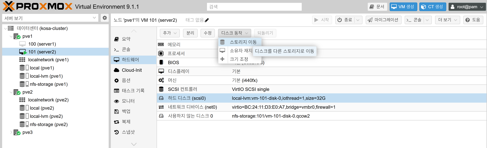
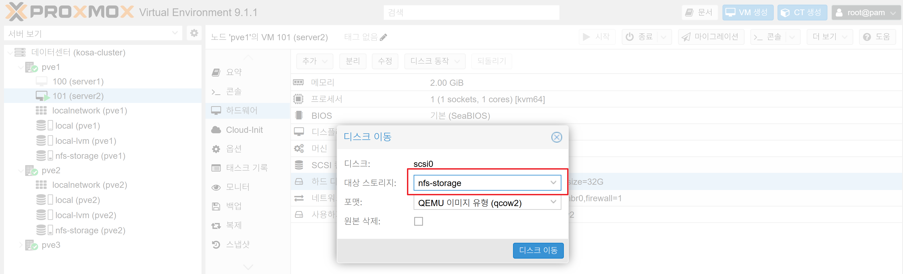

# Proxmox VE 클러스터  NFS 연동

# ✅ 1. 핵심 개념

👉 Proxmox에서 NFS는 **“Datacenter 레벨”에서 추가해야 모든 노드(pve1, pve2, pve3)가 공유함**

👉 잘못된 방법:

* pve1 노드에서만 추가 ❌

👉 올바른 방법:

* **Datacenter → Storage → Add → NFS** ✅

---

# ✅ 2. GUI로 추가 

## 📍 위치

```
Datacenter
  → Storage
    → Add
      → NFS
```

---

## 📋 설정 값

| 항목      | 값                        |
| ------- | ------------------------ |
| ID      | nfs-storage              |
| Server  | 192.168.0.8              |
| Export  | /mnt/nfs                 |
| Content | Disk image, Container    |
| Nodes   | ✅ pve1, pve2, pve3 모두 체크 |

---

## 🔥 가장 중요한 설정

👉 **Nodes 전체 선택**

* 하나라도 빠지면 HA 실패

---

# ✅ 3. CLI로 추가 (자동화용)

pve1에서 실행하면 클러스터 전체에 적용됨

```bash
pvesm add nfs nfs-storage \
  --server 192.168.0.8 \
  --export /mnt/nfs \
  --content images,rootdir \
  --options vers=3 \
  --nodes pve1,pve2,pve3
```

---

# ✅ 4. 추가 후 확인 (필수🔥)

```bash
pvesm status
```

👉 정상 출력 예:

```bash
nfs-storage    nfs    active
```

---

# ✅ 5. 실제 마운트 확인

```bash
df -h
```

👉 확인 포인트:

```
/mnt/pve/nfs-storage
```

---

# ✅ 6. 모든 노드에서 확인 (중요)

각 노드에서:

```bash
pvesm status
```

👉 3개 노드 모두 `active`여야 정상

---

# ✅ 7. 테스트 (반드시 해보기)

```bash
touch /mnt/pve/nfs-storage/testfile
```

👉 에러 없으면 성공

---

# VM 디스크 NFS 이동

NFS 추가 완료되면 바로:

## VM 디스크 이동

1. GUI로 이동

📍 위치

```
Datacenter
  → Node
    → 가상머신
      → 하드웨어
        → 하드 디스크(scsi0)
          → 디스크 동작
            → 스토리지 이동
```


대상 스토리지 선택 하고 [디스크 이동] 버튼을 클릭합니다.



디스크 이동 결과 화면


```bash
qm move_disk 100 scsi0 nfs-storage
```

## HA 등록

📍 위치

```
Datacenter
  → HA
    → 리소스
      → 추가
        → HA 구성할 가상머신 아이디
```

```bash
ha-manager add vm:100 --group ha-group
```

# HA 대상 VM 자체의 하드웨어 설정 (VM HW 구성)

## 🔥 1. 핵심 개념 (중요)

👉 Proxmox HA는 VM이 아래 조건을 만족해야 정상 동작합니다:

* 다른 노드에서 동일하게 실행 가능해야 함
* 특정 HW에 종속되면 안됨

👉 즉:

> **“이식 가능한 VM”이어야 한다**

---

## ✅ 2. HA용 VM 권장 HW 설정

### 🧠 CPU 설정

```bash
cpu: x86-64-v2-AES
```

---

### ✅ 권장 설정

```bash
qm set 101 --cpu kvm64
```

또는 (동일 CPU 환경이면)

```bash
qm set 101 --cpu host
```

---

### 🔥 기준

| 옵션    | 설명                |
| ----- | ----------------- |
| kvm64 | 가장 안전 (이식성 최고)    |
| host  | 성능 최고 (동일 CPU 필요) |

---

## 💾 3. 디스크 설정 (가장 중요🔥)

### ✅ 필수 조건

```bash
scsi0: nfs-storage:...
```

👉 반드시:

* NFS / Ceph 같은 **shared storage**

---

### ❌ 금지

```bash
local-lvm:vm-xxx-disk
```

👉 HA 불가능

---

### ✅ 디스크 타입

```bash
scsihw: virtio-scsi-single
```

👉 성능 + migration 최적

---

### ✅ 캐시 설정 (추천)

```bash
cache=writeback
```

---

## 🌐 4. 네트워크 설정

### ✅ 권장

```bash
net0: virtio=XX:XX:XX,bridge=vmbr0
```

👉 virtio 필수 (성능 + migration)

---

### ❗ 주의

* bridge 이름 모든 노드 동일해야 함

  * vmbr0 ✔
  * 다르면 migration 실패

---

## 💿 5. CD-ROM (중요)

### ❌ 문제 원인

```bash
ide2: local:iso/xxx.iso
```

👉 local ISO는 다른 노드에서 없음

---

### ✅ 해결

```bash
qm set 101 --delete ide2
```

---

## 🧮 6. 메모리 설정

```bash
memory: 2048
```

👉 HA와 직접 관계 없음
👉 하지만:

* ballooning 사용 가능

---

### ✅ 추천

```bash
balloon: 1024
```

---

## ⚙️ 7. NUMA / 기타

### ❌ 비추천

```bash
numa: 1
```

👉 HA 시 문제 가능

---

### ✅ 권장

```bash
numa: 0
```

---

## 🔐 8. PCI / GPU 패스스루

### ❌ 절대 금지 (HA 불가)

* GPU passthrough
* PCI device passthrough
* USB passthrough

👉 이유:
→ 특정 노드 종속

---

## 🔥 9. 최종 “정상 HA VM 예시”

```bash
boot: order=scsi0
cores: 2
memory: 4096
cpu: kvm64
scsi0: nfs-storage:101/vm-101-disk-0.qcow2
scsihw: virtio-scsi-single
net0: virtio=XX:XX:XX,bridge=vmbr0
ostype: l26
numa: 0
```

---

## 🚨 10. HA 실패하는 대표 설정

| 항목              | 문제 |
| --------------- | -- |
| local 디스크       | ❌  |
| ISO 연결          | ❌  |
| GPU passthrough | ❌  |
| bridge 다름       | ❌  |
| CPU mismatch    | ❌  |

---

## 💡 실무 기준 체크리스트

👉 이 5개만 맞으면 HA 100% 가능

✔ shared storage (NFS/Ceph)
✔ CPU 호환
✔ ISO 제거
✔ 동일 네트워크
✔ passthrough 없음

---

## 🎯 핵심 한 줄

👉 **“HA VM은 어디 노드에서든 똑같이 실행될 수 있어야 한다”**
