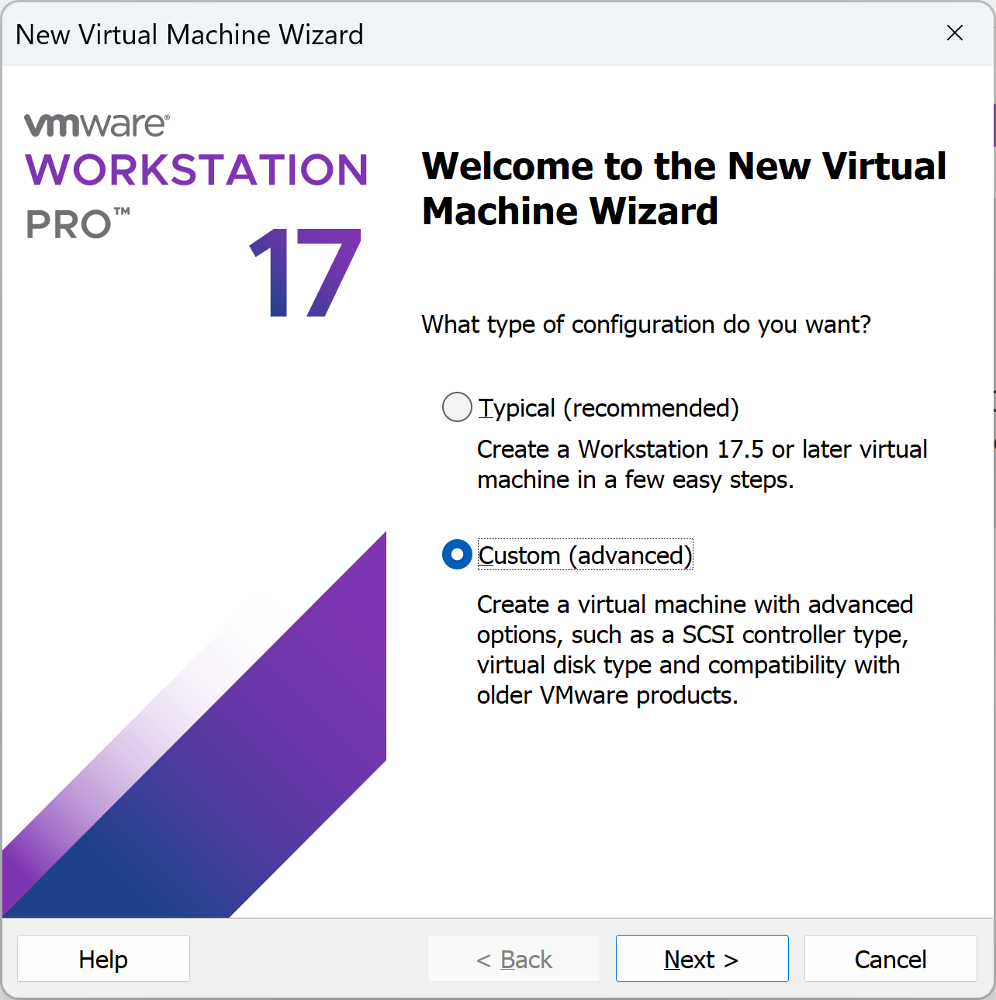
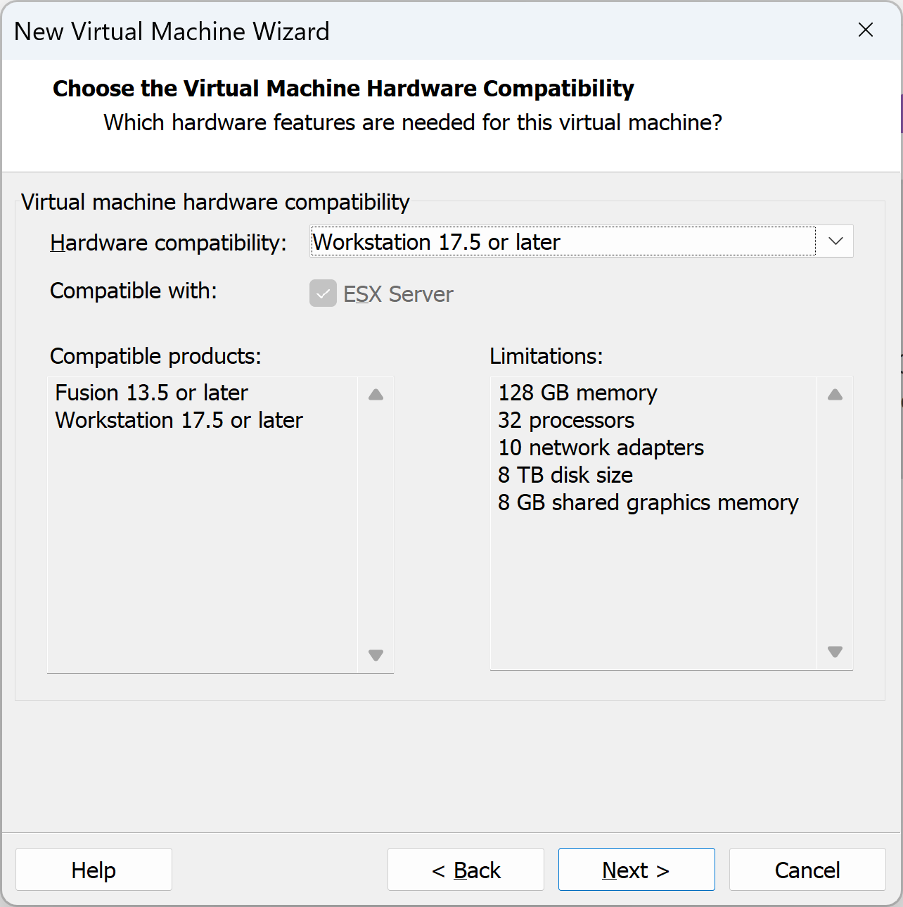
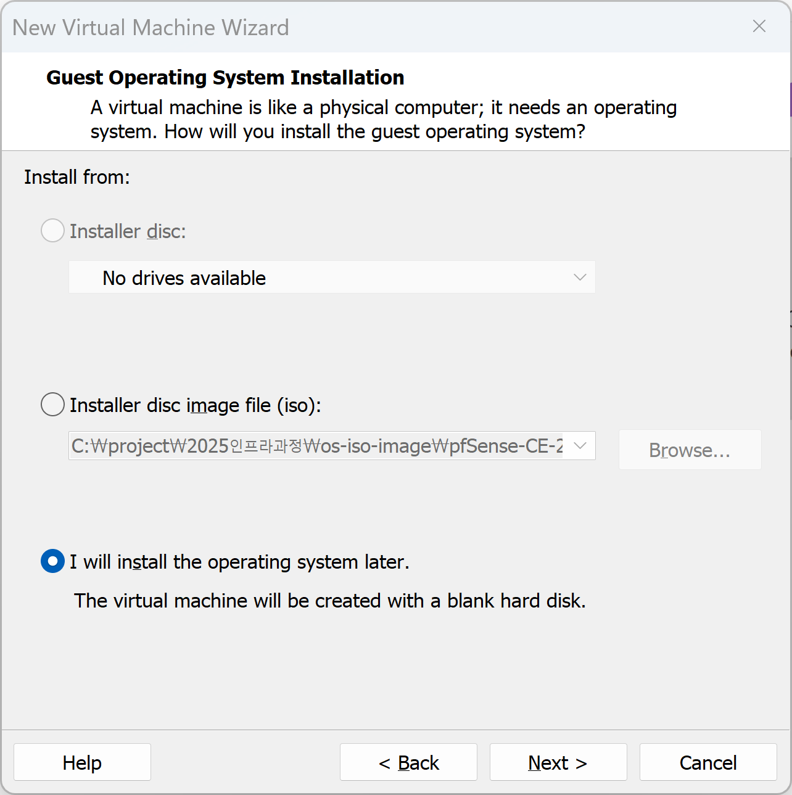
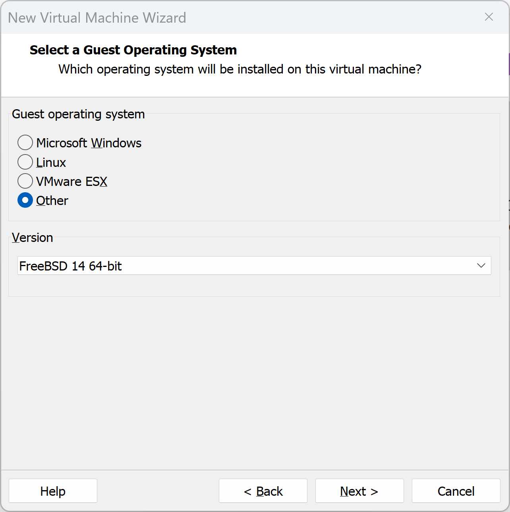
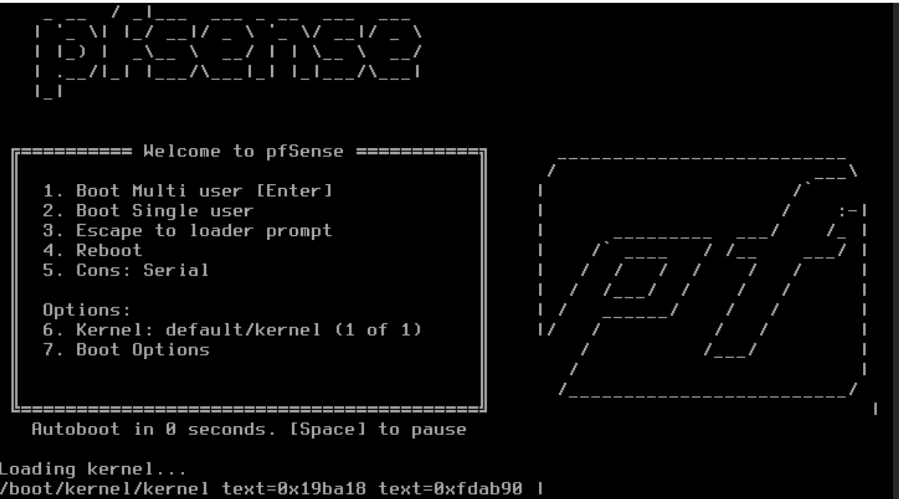

# pfSense 설치

pfSense는 FreeBSD 기반이므로 설정 시 OS 타입을 정확히 지정하는 것이 중요하며, 방화벽 특성상 최소 2개의 네트워크 어댑터(WAN, LAN)가 필요합니다. 단계별 가이드는 다음과 같습니다.

---

## 1. 사전 준비

* **ISO 다운로드:** [pfSense 공식 홈페이지](https://www.pfsense.org/download/)에서 `Architecture: AMD64 (64-bit)`, `Installer Type: DVD Image (ISO) Installer`를 선택하여 다운로드 후 압축을 풉니다.
* **네트워크 구상:** * **WAN:** 외부 인터넷 연결 (VMware의 **Bridged** 또는 **NAT** 사용)
* **LAN:** 내부 가상 네트워크 (VMware의 **Host-only** 또는 **LAN Segment** 사용)

## 2. 가상 머신(VM) 생성

1. **New Virtual Machine Wizard:** 'Typical'보다는 **'Custom (advanced)'**을 권장합니다.

2. **Virtual Machine Hardware 호환**

3. **새가상머신 새성 마법사**

4. **OS 선택:** `Guest Operating System`에서 **Other**를 선택하고, 버전은 **FreeBSD 14 64-bit** (혹은 최신 pfSense 버전에 맞는 FreeBSD 버전)를 선택합니다.

5. **가상머신이름**

6. **사양 할당:** * **CPU/RAM:** 1 CPU, 1GB RAM이면 충분하지만, 패키지(Snort 등) 사용 계획이 있다면 2GB 이상을 추천합니다.
* **Disk:** 20GB 정도면 넉넉합니다.

7. **네트워크 어댑터 추가:** 기본 생성된 어댑터 외에 **'Add...'**를 눌러 네트워크 어댑터를 하나 더 추가합니다.
* **Network Adapter 1 (WAN):** Bridged (공인/공유기 IP 할당용)
* **Network Adapter 2 (LAN):** Host-only (내부 VM들과 통신용)

## 3. pfSense 설치 과정

1. **부팅:** 생성한 VM에 ISO를 마운트하고 파워를 켭니다.
2. **Installer 실행:** 웰컴 화면에서 `Accept`를 누르고 **'Install'**을 선택합니다.
3. **Keymap/Partition:** 기본값(Select, Auto (ZFS))으로 진행해도 무방합니다.
4. **설치 완료 후 Reboot:** 설치가 끝나면 ISO를 마운트 해제하고 재부팅합니다.

## 4. 인터페이스 할당 (Console)

재부팅 후 콘솔 창에서 인터페이스를 잡아야 합니다.

1. **VLAN setup:** 보통 `n`을 입력하여 건너뜁니다.
2. **WAN 인터페이스:** `em0` (VMware의 첫 번째 어댑터)를 입력합니다.
3. **LAN 인터페이스:** `em1` (두 번째 어댑터)을 입력합니다.
4. 설정이 완료되면 WAN은 외부 IP를, LAN은 기본값인 `192.168.1.1`을 갖게 됩니다.

## 5. Web GUI 접속 및 초기 설정

1. **클라이언트 준비:** 동일한 LAN(Host-only 등)에 연결된 다른 Windows/Linux VM을 켭니다.
2. **접속:** 브라우저에서 `https://192.168.1.1`에 접속합니다.
* **ID:** `admin` / **PW:** `pfsense`

3. **Setup Wizard:** 호스트네임, DNS, 타임존 등을 설정합니다.
* **주의:** WAN이 사설 IP 대역(공유기 하단)에 있다면 Wizard 마지막 단계에서 `Block private networks from entering via WAN` 체크를 해제해야 외부 통신이 원활할 수 있습니다.

