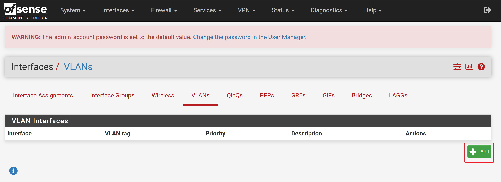

# VLAN 4개 생성

메뉴 이동:
    Interfaces -> Assignments -> VLANs

1. Add 버튼을 클리하고 VLAN을 아래와 같이 설정합니다.

등록을 위한 입력양식 화면

2. [Save] 버튼을 클릭하여 등록합니다.

등록된 결과 화면

3. 위와 같은 방법으로 VLAN20, 30, 40을 등록합니다.

최종 등록 화면

