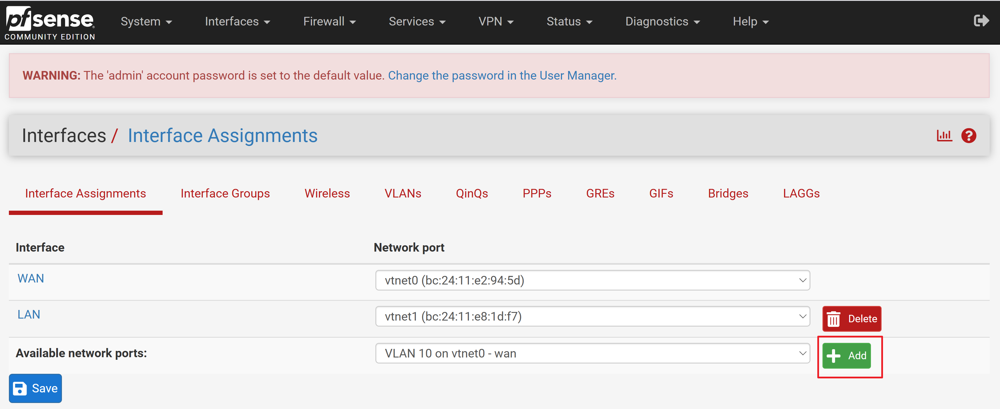
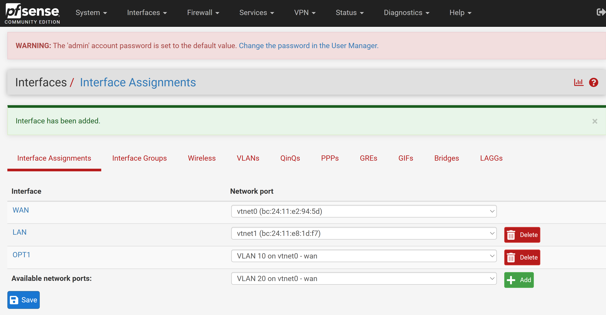
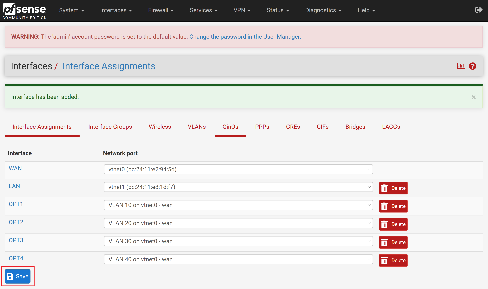
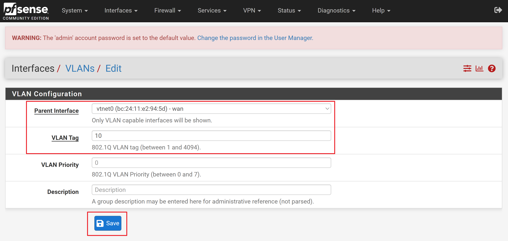
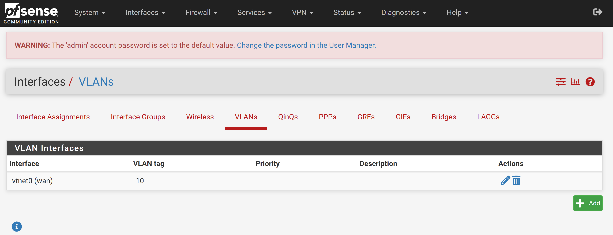
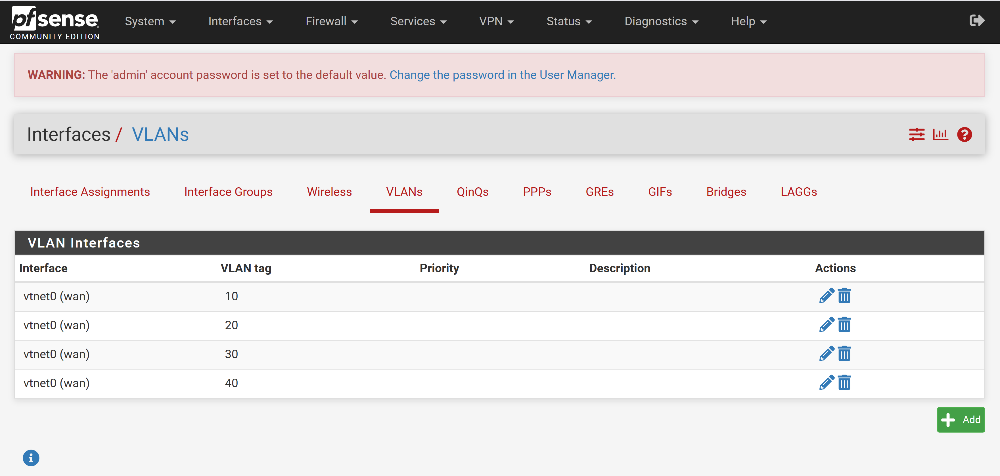

# VLAN 인터페이스 등록

메뉴 이동:
    Interfaces -> Assignments -> Interface Assignment

1. Add 버튼을 클리하고 VLAN을 인터페이스로 등록합니다

등록 결과 화면

>위 Add 버튼을 클릭 한 후 반드시 pfSense Shell에서 pfctl -d 을 실행해야 합니다.
실행하지 않으면 계속 응답이 대기 상태가 되서 진행을 할 수 없습니다.

2. 같은 방법으로 VLAN20, 30, 40을 등록합니다.

>위 Add 버튼을 클릭 한 후 반드시 pfSense Shell에서 pfctl -d 을 실행해야 합니다.
실행하지 않으면 계속 응답이 대기 상태가 되서 진행을 할 수 없습니다.

최종 등록 화면

반드시 [Save] 버튼을 클릭해야 합니다.

>위 Save 버튼을 클릭 한 후 반드시 pfSense Shell에서 pfctl -d 을 실행해야 합니다.
실행하지 않으면 계속 응답이 대기 상태가 되서 진행을 할 수 없습니다.

등록을 위한 입력양식 화면

2. [Save] 버튼을 클릭하여 등록합니다.

등록된 결과 화면

3. 위와 같은 방법으로 VLAN20, 30, 40을 등록합니다.

최종 등록 화면

