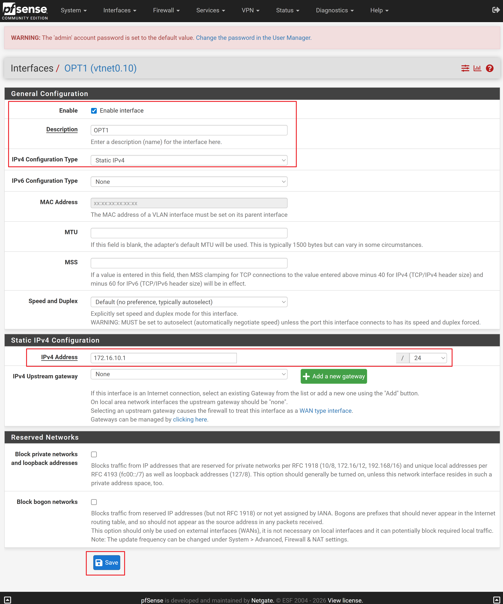
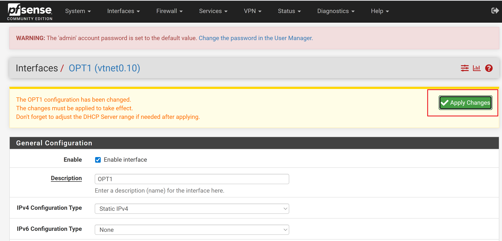
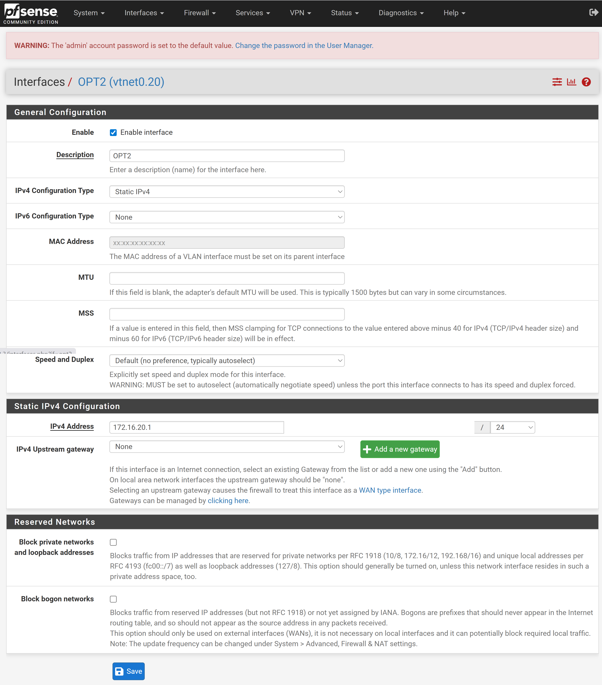
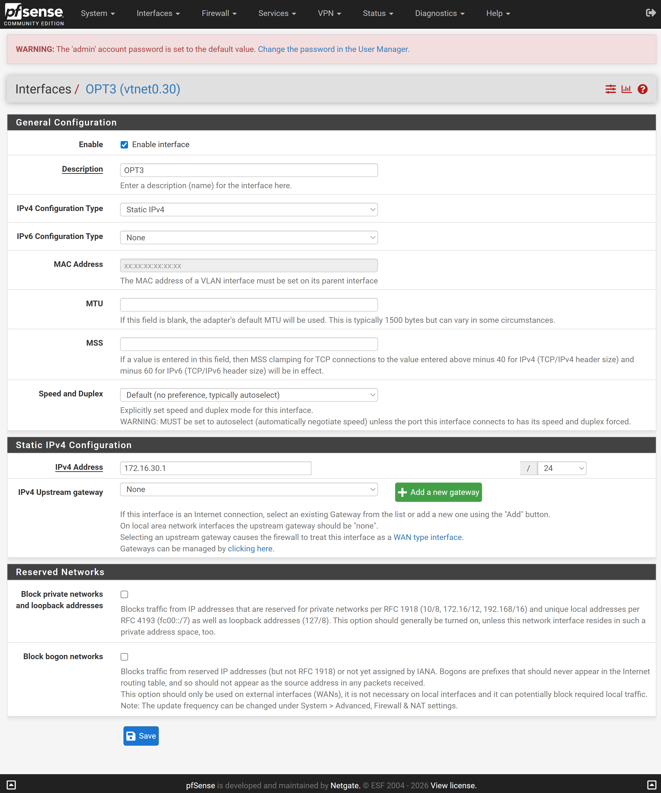

# OPT NIC에 대한 설정

메뉴 이동:
    Interfaces -> OPT1

### OPT의 상태

    - Enable 체크
    - Static IPv4 설정
    - 172.16.10.1/24
    - 으로 설정 하고 저장함

반드시 [Save] 버튼을 클릭해야 합니다.

>위  Apply Changes 버튼을 클릭 한 후 반드시 pfSense Shell에서 pfctl -d 을 실행해야 합니다.
실행하지 않으면 계속 응답이 대기 상태가 되서 진행을 할 수 없습니다.

### 같은 방법으로 OPT2,3,4 등록합니다

