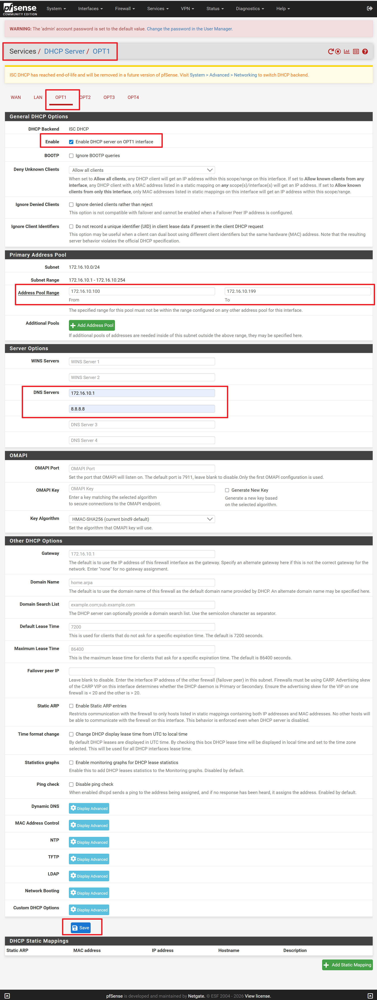
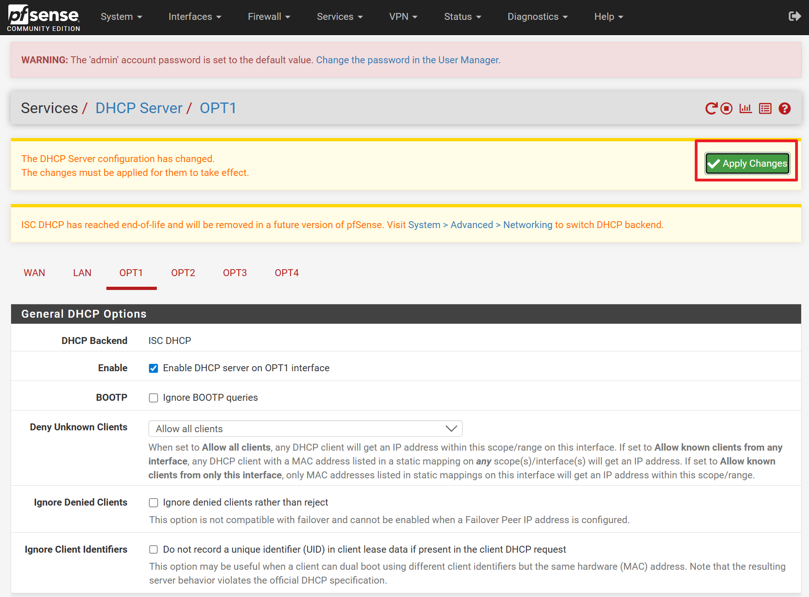

# VLAN DHCP 설정

메뉴 이동:
    Services → DHCP Server → OPT번호

|VLAN | Enable | DHCP 범위 | DNS Servers | DNS Servers |
|---|---|---|---|---|
|10	| checked | 172.16.10.100~200 | 172.16.10.1 | 8.8.8.8 |
|20	| checked | 172.16.20.100~200 | 172.16.20.1 | 8.8.8.8 |
|30	| checked | 172.16.30.100~200 | 172.16.30.1 | 8.8.8.8 |
|40	| checked | 172.16.40.100~200 | 172.16.40.1 | 8.8.8.8 |

OPT1 의 DHCP 서버 설정 화면

[Save] 버튼을 클릭하여 등록합니다.

>위  [Apply Changes] 버튼을 클릭 한 후 반드시 pfSense Shell에서 pfctl -d 을 실행해야 합니다.
실행하지 않으면 계속 응답이 대기 상태가 되서 진행을 할 수 없습니다.

같은 방법으로 OPT2,3,4 등록합니다.

