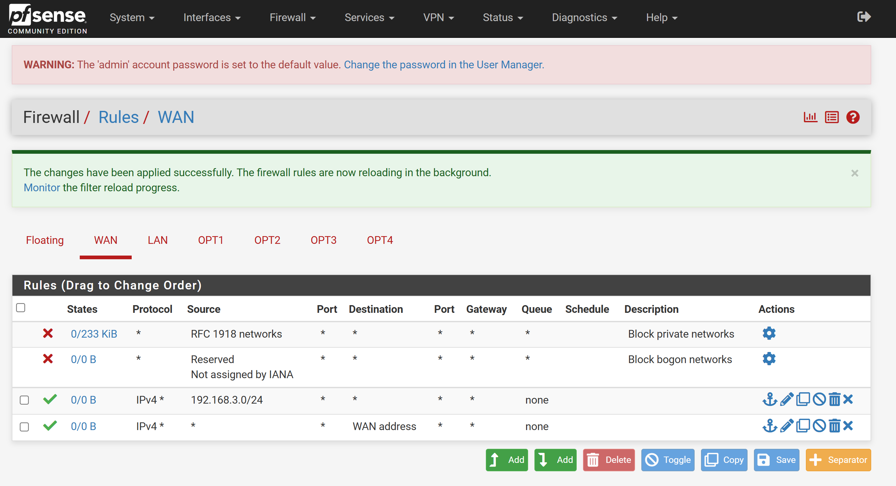
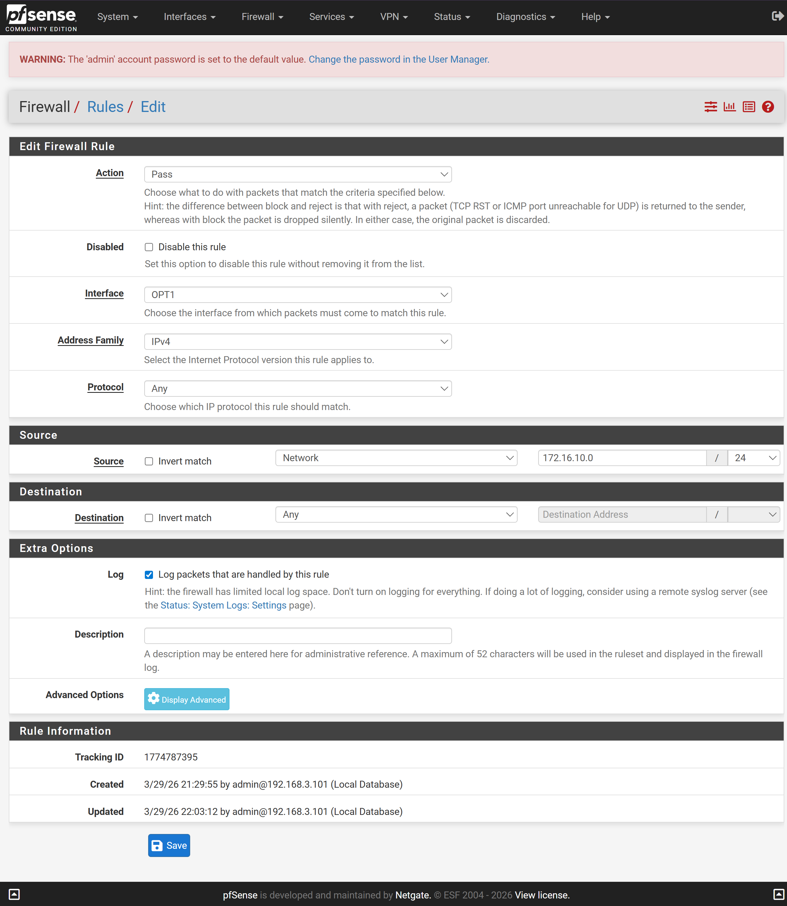

# 방화벽 설정

## WAN 방화벽 설정

메뉴 이동:
    Firewall → Rules → WAN

### 192.168.3.0/24 대역에 대한 방화벽 추가

[^ Add] 상단에 추가하는 버튼을 클릭하여 새로운 룰을 추가합니다.

| 종류 | 설정값 |
|---|---|
| Action | Pass |
| Interface | WAN |
| Address Family | IPv4 |
| Protocol | Any |
| Source | Network , 192.168.3.0/24 |
| Destination | Any |
| Log | Checked |

추가된 결과 화면

>저장 후 [Apply Changes] 버튼을 클릭 한 후 반드시 pfSense Shell에서 pfctl -d 을 실행해야 합니다.
실행하지 않으면 계속 응답이 대기 상태가 되서 진행을 할 수 없습니다.

---

### OPT1 에 대한 방화벽 추가

[^ Add] 상단에 추가하는 버튼을 클릭하여 새로운 룰을 추가합니다.

| 종류 | 설정값 |
|---|---|
| Action | Pass |
| Interface | OPT1 |
| Address Family | IPv4 |
| Protocol | Any |
| Source | Networks, 172.16.10.0/24 |
| Destination | Any |
| Log | Checked |

추가된 결과 화면

>저장 후 [Apply Changes] 버튼을 클릭 한 후 반드시 pfSense Shell에서 pfctl -d 을 실행해야 합니다.
실행하지 않으면 계속 응답이 대기 상태가 되서 진행을 할 수 없습니다.

같은 방법으로 OPT2, 3, 4 등록합니다.

---

